### 前置安装

1.**[Node.js (nodejs.org)](https://nodejs.org/en/)**(Node.js 版本需不低于 10.13，建议使用 Node.js 12.0 及以上版本)

2.**[Git (git-scm.com)](http://git-scm.com/)**

3.**淘宝镜像（非必要）**`npm config set registry https://registry.npm.taobao.org` 

​		用了淘宝镜像可以更快下载资源包。

​		使用`npm config get registry`来查看是否配置完成。

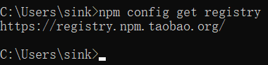

​		显示地址说明配置完成。

4.安装hexo

[Hexo](https://hexo.io/zh-cn/)官网地址(更详细的安装配置等可以看官方文档)

使用`npm install hexo-cli -g`可将hexo全局配置。

使用`npx hexo`可以来查看hexo是否安装成功。

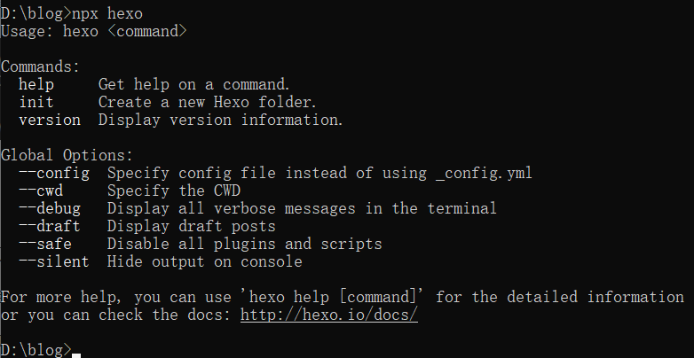

出现相关命令则安装成功。

##  

###  hexo初始化

到任意磁盘位置创建一个文件夹并打开cmd使用`hexo init`命令对目标文件夹初始化（这里以D:\\blog为例）

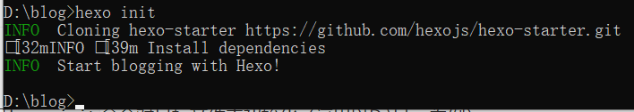

检查文件夹是否有以下几种文件：

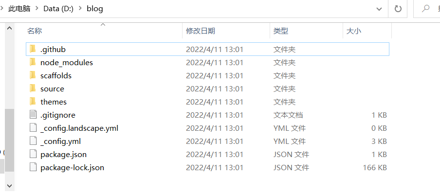

没有报错则初始化成功。(如果有问题大部分是node.js版本或git未安装导致)

在控制台使用`hexo s`可以在本地查看blog效果如何，如果有页面显示说明已成功安装了hexo。

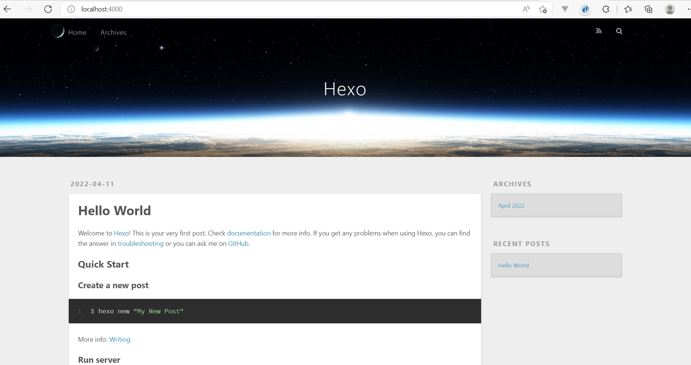

在cmd页面使用`ctrl+c`可以结束本地端口运行。

###  hexo配置

这里主要先搭建github仓库远程上传代码，先在git将仓库建好。

进入github首页点右上角`sign in`登录，然后在`Repositories`中new一个新仓库

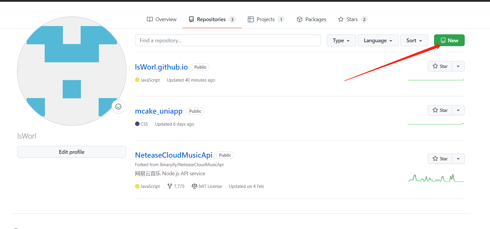

Repository name 以自己的`github账号名.github.io`来命名，没有其他要求点击`create respository`创建仓库即可。

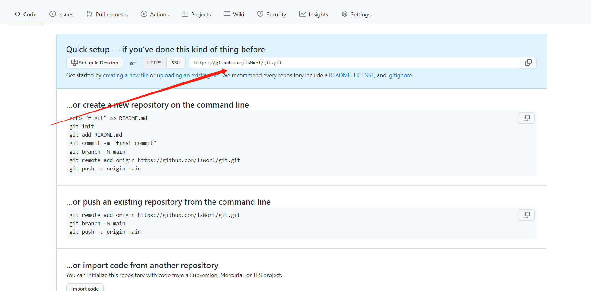

将自己仓库的HTTPS地址复制下来（因为我已经建过blog仓库这里就没以`github账号名.github.io`来命名了，可以看上一张图的第一个仓库来作为参考）

**仓库建完成后在cmd中使用`npm install hexo-deployer-git --save`来安装插件。**

然后**相关配置**需要打开`_config.yml`文件，详细信息需要看文档进行配置。

这里先配置`Deployment`（位置在最底下）

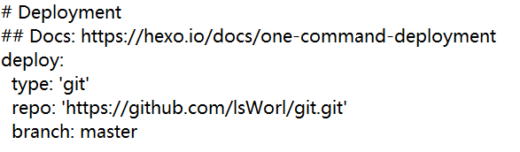

`repo`放刚刚复制的github仓库地址，保存后在自己文件夹cmd使用`hexo clean`清除缓存文件（`db.json`）和已生成静态文件（`public`），后使用`hexo g`生成静态文件。（最好在每次上传仓库前重复以上两个步骤）

然后`hexo d`来将本地部署到github中

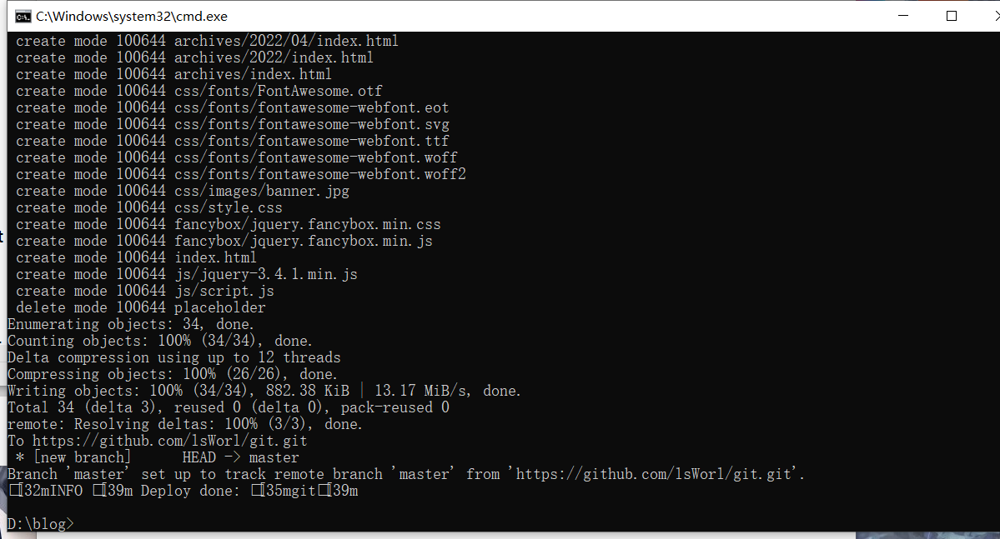

出现自己github仓库地址后，刷新网页。

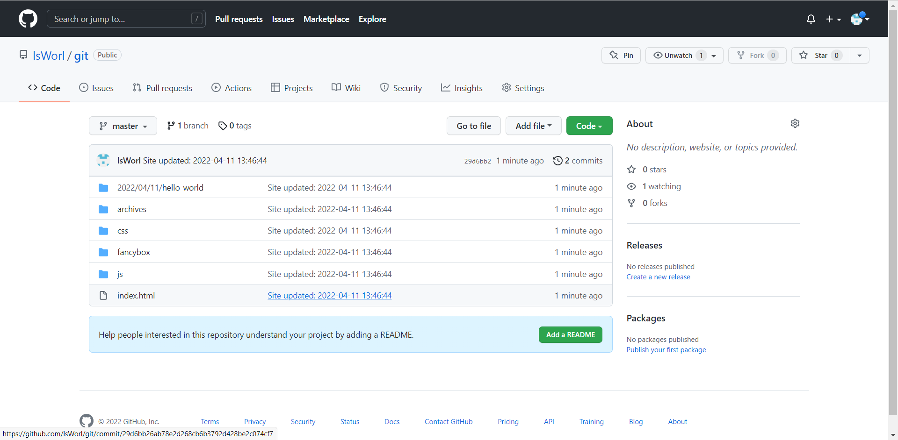

出现文件说明上传成功，可以通过标蓝的地址名来进行线上访问（不过由于在国内有时候会访问不上，可以Netlify等网络托管平台来进行布置）

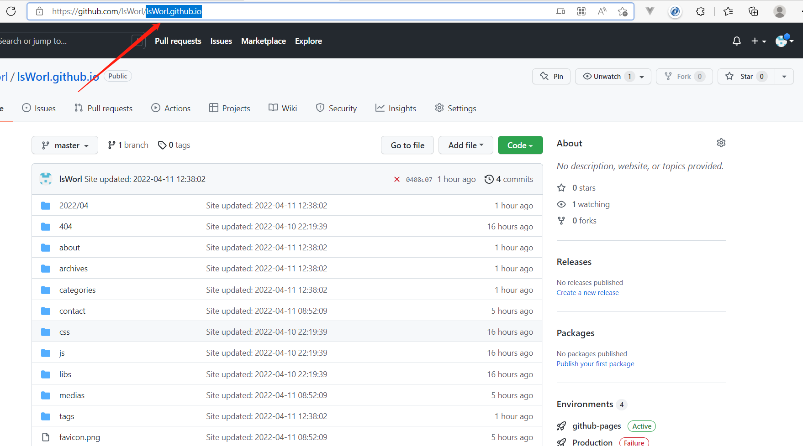

（这里我是以我原先布置的blog来进行展示）

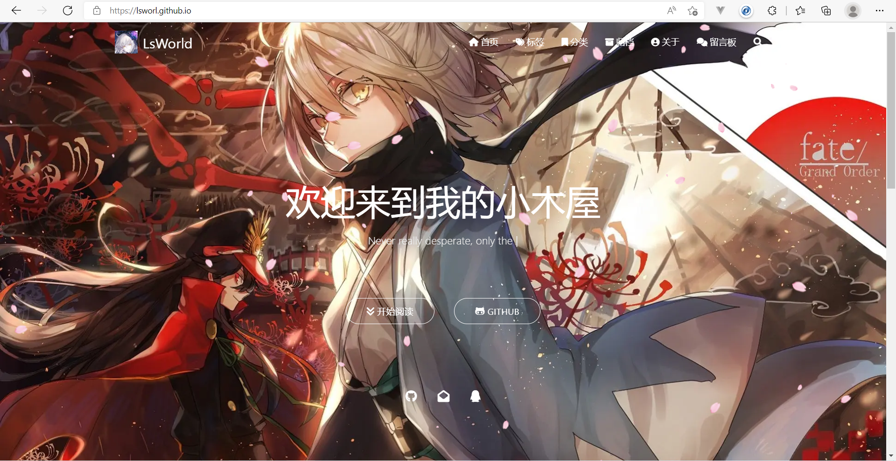

看来类似这个页面就是已经部署成功了。

###  配置主题(这里以matery主题为例)

在自己blog文件夹的themes路径下下输入`git clone https://github.com/blinkfox/hexo-theme-matery.git`从github上clone项目到themes文件夹中

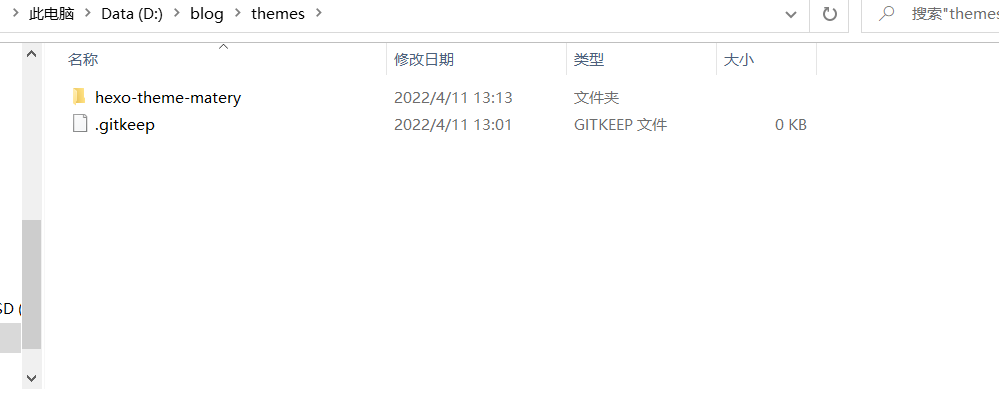

主题配置在源文件夹`_config.yml`文件的theme中。

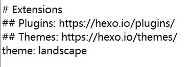

将`landscape`替换成要更换的主题，即`hexo-theme-matery`

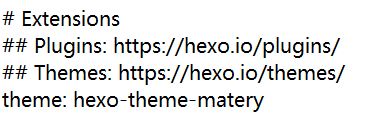

然后在cmd使用`hexo s`来进行本地查看是否生效

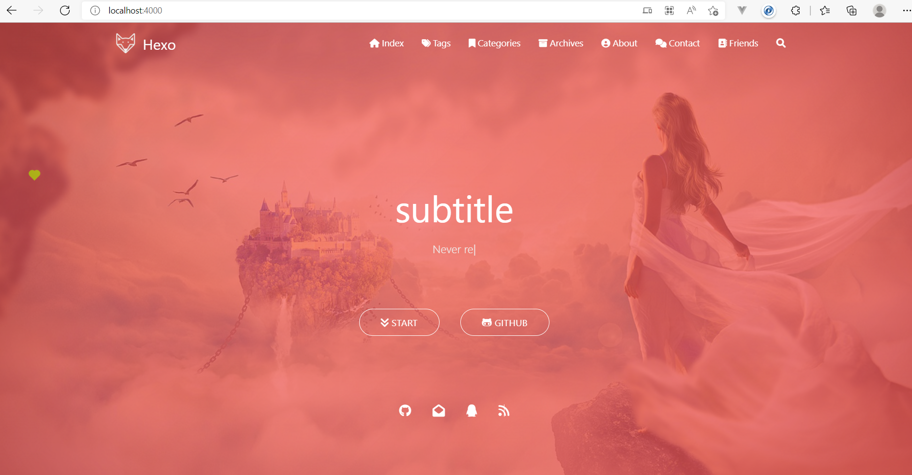

发现页面更换了就说明已经使用了主题，相关更多的配置可以在`hexo-theme-matery`的作者文档中进行查看，也可以去源作者[blinkfox](https://github.com/blinkfox/hexo-theme-matery)中了解更多！
