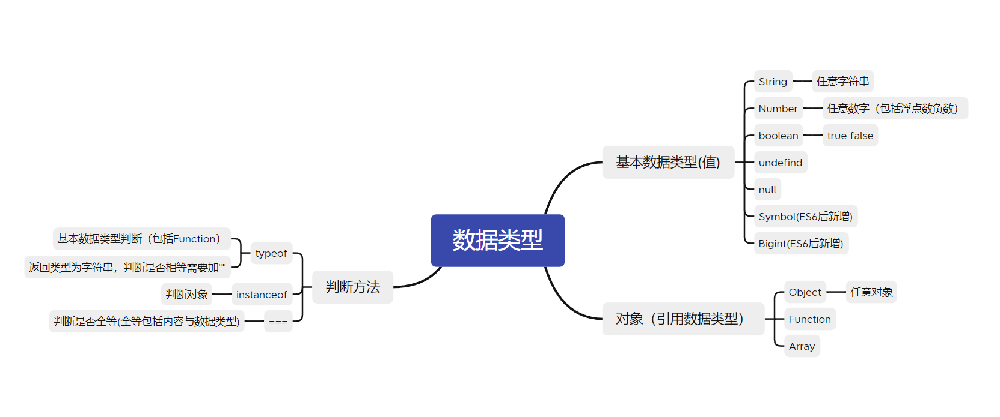
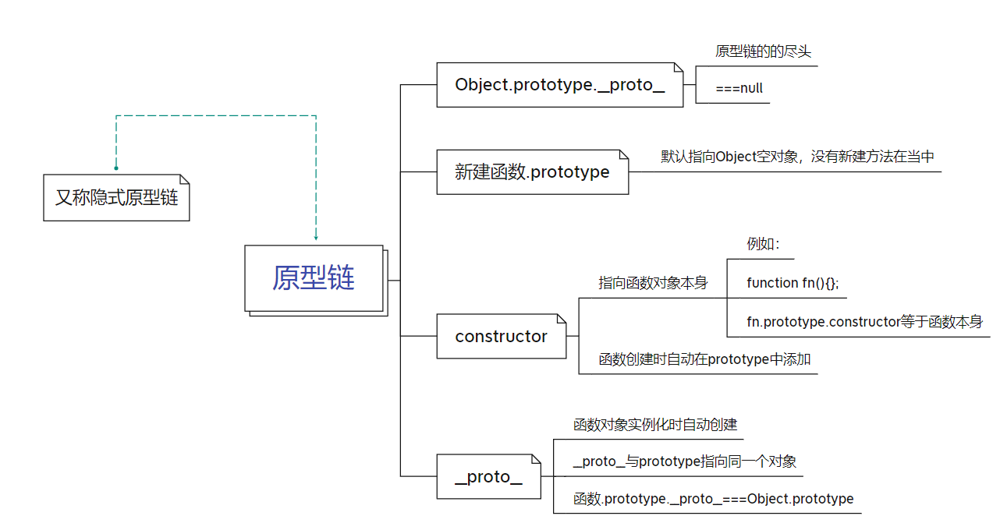
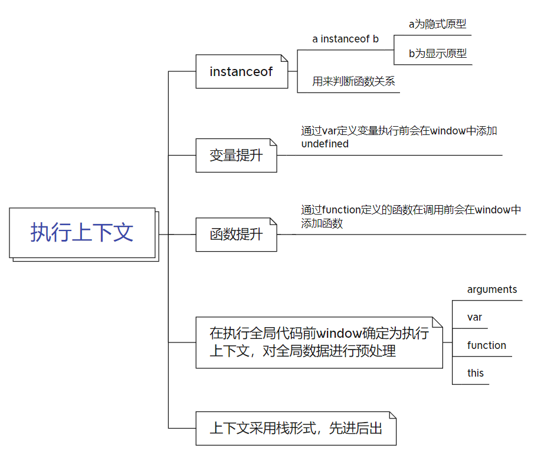
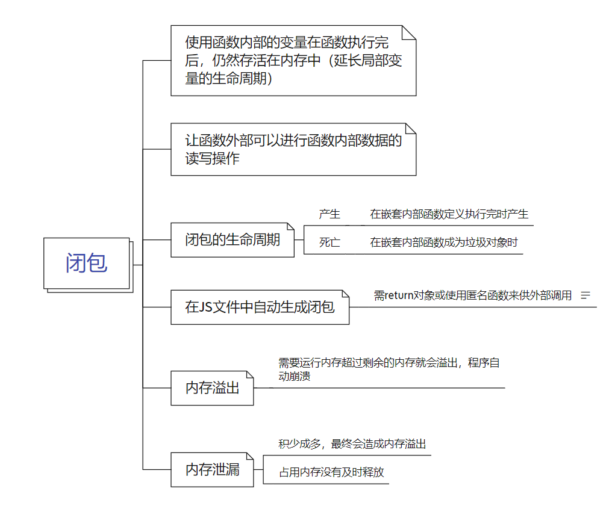

#### `javascript`的数据类型：



##### 使用`typeof`来判断数据类型

```javascript
console.log(typeof '字符串')//输出 string
console.log(typeof 123)//输出 number
console.log(typeof true)//输出 boolean
console.log(typeof null)//输出 object null输出object是历史遗留问题

let a
console.log(typeof a)//输出 undefined

const s = Symbol(1)
console.log(typeof s)//输出 symbol

const bigInt = 132n
console.log(typeof bigInt)//输出 bigint

const fn = function(){
    console.log('函数')
}
console.log(typeof fn)//输出 function

const arr = []
console.log(typeof arr)//输出 object

const obj = {}
console.log(typeof obj)//输出 object
```


##### 使用`instanceof`判断对象是否相等

判断方法： 实例对象 `instanceof` 构造函数

```javascript
function Fn(){}
const f = new Fn()
console.log(Fn instanceof Function)//返回true
console.log(f instanceof Fn)//返回true
console.log(Fn instanceof Object)//返回true 因为所有函数的原型链上都有Object方法

const arr = []
console.log(arr instanceof Array)//返回true
```


#### 对象

对象是用数据来表示现实中的某一个具体的事物，对象中通常存储多个数据。

对象由一组`key:value`来相互对相应

对象中属性调用方法：

- `key.value`
- `key['value']`

```javascript
//创建一个对象
const p = {
    name:'Tom',
    age: 18,
    setName: function (name){
        this.name = name
    },
    'special-type': 1
}
//第一种调用对象方法
console.log(p.name)//输出 Tom
//第二种调用对象方法
console.log(p['special-type'])//输出 1 用[]来调用必须加引号

const propName = 'Sname'
const value = 'Jack' 
p[propName] = value //当要传入的key不确定的时候可以使用这种方式调用
console.log(p) //输出 {name: 'Tom', age: 18, special-type: 1, Sname: 18, setName: ƒ}

```


#### 函数

定义函数的方法：

- 函数声明`function fn(){}`
- 表达式`const fn = function(){}`
- 匿名函数的方式`(function(){})()`

调用（执行）函数：

- `fn()`：直接调用
- `obj.fn()`：通过对象调用
- `new fn()`：new调用
- `fn.call/apply(obj)`：临时让`fn`称为`obj`的方法进行调用

```javascript
//定义函数
console.log(fn)//因为js预加载的缘故，这里会输出fn并不会报错
function fn(){
    console.log('fn被调用')
}

console.log(fn2)//报错，用es6语法声明函数变量并不会进行变量提升
const fn2 = function(){}

const obj = {}
//调用函数
fn() //输出 fn被调用

new fn() //输出 fn被调用 new主要用来实例化函数

fn.call(obj)//输出 fn被调用 call主要改变this的指向

//匿名函数  无需调用，自动执行，在common js中可以暴露js文件
(function () {
    console.log('这是一个匿名函数')
})()
```


##### 函数中的`this`

`this`的指向总的来说就是谁调用就指向谁（不用ES6的箭头函数的情况下）

```javascript
//创建一个函数
function Person(name) {
    console.log(this)
    this.name = name
    this.getName = function(){
        console.log(this)
        return this.name
    }
    this.setName = function(){
        console.log(this)
    }
}

Person('Tom')//此时this指向window

const p = new Person('Tom')//此时this指向p
p.setName() //此时this指向p

const obj = {}
p.setName.call(obj,'Tom')//使用call来改变this指向 此时this指向obj

const test = p.setName
test() //此时this指向window

function fn1(){
    function fn2(){
        console.log(this)
    }
    fn2()
}
fn1()//由于在全局中调用所以 此时this指向window
```


#### 原型与原型链



##### 原型

一般有需要有多个函数复用的方法或给实例对象使用的方法可以放到函数的原型上

- 每个函数都有一个`prototype`，即为显式原型（属性）
- 每个实例对象都有一个`__proto__`，可称为隐式原型（属性）
- 对象的隐式原型的值为其对应构造函数的显式原型的值

**堆中的函数对象创建的`prototype`也是一个地址值**

```javascript
//新建一个函数
function Fn(){}
console.log(Fn.prototype)//默认指向一个Object空对象 输出 object对象 这里不考虑函数提升

//给原型对象添加属性 
Fn.prototype.test = function(){
    console.log('这是test函数')
}
console.log(Fn.prototype)//输出 object对象 其中有test方法

//创建实例对象
const fn = new Fn()
fn.test()//输出 '这是test函数'

//原型对象中的constructor方法，它指向函数对象本身
console.log(Fn.prototype.constructor === fn) //输出 true
```


```javascript
function Fn(){}
const fn = new Fn()
//判断实例对象的原型是否和函数的原型相等
console.log(fn.__proto__ === Fn.prototype)//输出 true

//判断实例对象的地址值是否与函数的地址值相等
console.log(fn === Fn)//输出 false

```


##### 原型链

在访问对象的一个属性时，首先会在自身所定义的属性中查找，若没有找到则会顺着`__proto__`进行查找，若最终没有找到会返回`undefined`


```javascript
function Fn(){}
const fn = new Fn()
const fn2 = new Fn()
//判断两个实例对象的原型是否相等
console.log(fn.__proto__ === fn2.__proto__)//输出 true
```


```javascript
function Fn(){}
//判断原型链的尽头是否为null
//Fn.prototype为Object函数对象
//Fn.prototype.__proto__ 为Object原型对象
console.log(Fn.prototype.__proto__.__proto__)//输出 null
```


#### 变量提升和与函数提升

在`javascript`用`var`和 `function`声明的变量和函数会在赋值前提前就可以提前访问到

```javascript
//变量提升
console.log(a)//输出undifined 并不会报错
var a = 1

//函数提升
fn()//输出 'fn()'
function fn(){
    console.log('fn()')
}

//判断先函数提升还是先变量提升
function Fn(){}
var Fn
console.log(typeof Fn)//输出 function
//结果先执行变量提升，在进行函数提升，所以最后函数覆盖了变量
```


#### 执行上下文




##### 全局执行上下文

在执行全局代码前会将`window`确定确定为全局执行上下文。

对全局数据会进行预处理

- `var`定义的全局变量会先赋值为`undefined`
- `function`声明的全局函数会赋值为`fun`

预处理结束以后才会执行全局代码 **所以才会有了上方的函数提升与变量提升**


##### 函数执行上下文

在调用函数，准备执行函数体之前，创建对应的函数执行上下文对象

对局部数据进行预处理

- 形参变量进行赋值（实参）
- `arguments`进行赋值（实参列表）
- `var`定义的局部变量为`undefined`
- `function`声明的函数会赋值为`fun`

```javascript
var a = 1
function fn2(){
    console.log('fn2()')
}
function fn(num){
    console.log(a)//输出 undifined 因为内部定义了 a 所以会先预处理内部属性，要是内部没有定义才会向上一级进行查找
    var a = 2
    console.log(a)//输出 2
    console.log(num)//输出 1
    fn2()//输出 'fn2()'
    console.log(arguments)//输出 Arguments(4) [1, 2, 3, 4, callee: ƒ, Symbol(Symbol.iterator): ƒ]
}
fn(1,2,3,4)
```

**即使return了函数也会将下面代码执行完再出栈**


#### 作用域

分为全局作用域和函数作用域与块作用域（用`const`和`let`进行声明变量）

作用域主要问题用于隔离变量，不同作用域下的同名变量不会冲突

与执行上下文区别：

- 除全局作用域外，作用域在函数定义时就已经确定了，而不是在函数调用时
- 全局执行上下文实在全局作用域确定之后，js代码马上执行之前创建


```javascript
var a = 1
function fn1(c){
    var b = 2 
    console.log(a,b,c) //输出 '1 2 3' a是从全局作用域中寻找到的值
    function fn2(){
        var d = 4
        console.log(a,b,d,c) //输出 '1 2 4 3' a,b都是从外部作用域中寻找到的值
    }
    fn2(3)
}
fn1(3)//这里传参3
```


#### 闭包



当一个嵌套的内部函数引用了外部函数的数据（变量/函数）并执行外部函数就会产生闭包

闭包的作用：

- 使用函数内部的变量在函数执行完后，仍然存活在内存中（延长了局部变量的生命周期）
- 让函数外部可以操作（读写）到函数内部的数据

```javascript
function fn1(){
    var a = 1 //因为函数提升，此时闭包就已经创建
    function fn2(){
        a++ //此时调用了外部的变量就会产生闭包
        console.log(a)
    }
}
var f = fn1()
f()//调用函数 输出 3
f()//调用函数 输出 4
f = null//包含闭包函数对象成为垃圾对象 闭包才会死亡 不然会一直占用内存
```


#### JS运行机制

##### 主线程（同步执行）

- JS引擎模块
- `html`，`css`文档解析模块
- `DOM/CSS`模块 等等...

##### 分线程（异步执行）

包括宏队列与微队列

宏队列：

- `dom`事件回调
- `ajax`回调
- 定时器回调

微队列：

- `promise`回调
- `mutation`回调


```javascript
//最后控制台输出 3 6 4 7 1 2 5
setTimeout(()=>{ //定时器中的代码属于宏队列中，会在同步代码与微队列中的代码执行完成后最后再进行执行
    console.log(1)
    console.log(2)
},0)
const p = new Promise((resolve,reject)=>{ //Promise的内部代码是同步先执行的，只有调用了then或catch等方法才会进入微队列成为异步执行
    console.log(3)
    resolve()
})
p.then(value=>{//Promise的then为微队列中的代码，会在同步代码全部执行完后进行执行，在宏队列的代码之前执行
    console.log(4)
    setTimeout(()=>{//即使定时器then内部也不会优先执行，还是会进入到宏队列中
		console.log(5)
	},0)
})
function Fn2(){
    console.log(6)
}
async function Fn(){//async里面的代码是同步执行的
    console.log(8)
    await Fn2()//通过await调用Fn2()
    console.log(7)//这里的代码要等上方的Fn2()的Promise执行完才执行
}
Fn()
```


#### Web Worker(用的比较少)

因为js是单线程运行，为了增加运行的效率，h5中引入了新的api使得js可以模拟多线程运行，但同时也有一些缺点：

- 运行速度比较慢
- 不能跨域加载JS
- `worker`内代码不能访问DOM（因为worker代码的`this`不是指向`window`）
- 浏览器兼容性差


```javascript
//创建一个Worker对象
var worker = new Worker('worker.js')//内部传参为js文件夹名加后缀
var number = 123
//绑定接收消息的监听
worker.onmessage = function(event){
    console.log('分线程返回的数据' + event.data) //输出分线程返回的数据124
}
//向分线程发送消息
worker.postMessage(number)
console.log('向分线程发送数据' + number)
```


```javascript
//worker.js文件
var onmessage = function(event){ //这里不能使用函数声明，只能用变量声明，并且不能用const let，否则不会返回数据
    var number = event.data
    console.log('分线程收到主线程发送的数据'+number)
    postMessage(number+1)//向主线程发送数据
}
```

