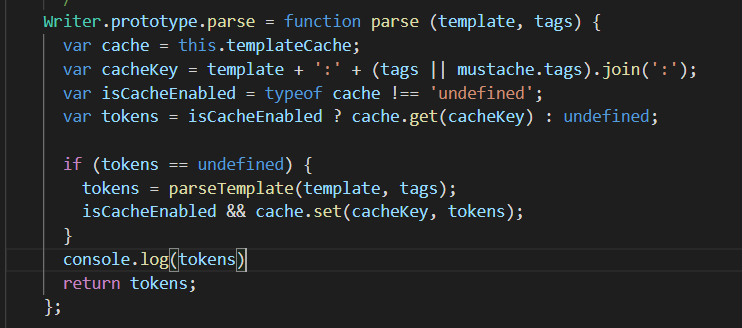
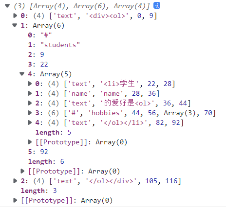

### mustache模板引擎

模板引擎是将数据变为视图的最优雅解决方案，用`{{}}`来进行表示

`mustache`官方git: [janl/mustache.js: Minimal templating with {{mustaches}} in JavaScript (github.com)](https://github.com/janl/mustache.js)

#### 使用正则表达式来实现简单的模板替换


```javascript
var templateStr = '<h1>标题{{title}},内容{{content}}</h1>' 
var data = {
    title: '模板',
    content: '了解'
}
// 正则中用\进行转义 \w搜索字母 /g表示全局搜索
//replace方法接收到参数
var replaceStr = templateStr.replace(/\{\{(\w+)\}\}/g,function(findStr,$1){
    console.log(findStr,$1) //输出 {{title}} title  {{content}} content
    return data[$1]
})
console.log(replaceStr)
```

只能实现最简单的模板替换，无法实现循环等功能


#### 实现mustache模块的主要功能

`mustache`的主要功能就是以`tokens`为中介，将模板字符串进行编译成`dom`字符串，并在`tokens`解析时候结合数据。


```javascript
//要传入的数据 在mustache中 '#'表示循环 '/'表示循环结束  '.'表示简单数组的遍历

var templateStr = `<div>
        <ol>
            {{#students}} 
            <li>
                学生{{name}}的爱好是
                <ol>
                    {{#hobbies}}
                    <li>{{.}}</li>
                    {{/hobbies}}
                </ol>
            </li>
            {{/students}}
        </ol>
    </div>`
        var data = {
            students: [
                {"name":"小明","hobbies":["游泳","健身"]},
                {"name":"小红","hobbies":["足球","健身"]},
                {"name":"小强","hobbies":["吃饭","健身"]}
            ]
        }
    Mustache.render(templateStr,data) //将数据交给mustache进行解析，下方有介绍
```


##### 实现模板字符串转变为`tokens`

首先得要先了解什么是`tokens`



在源码部分添加`console.log()`在控制台中输出`tokens`



使用`Mustache.render(templateStr,data)`方法将数据输出

上方数据表明`tokens`为一个数组

`tokens[0]`共分为`text`，`name`，`#`三种

`text`用来表明遇到`{{`之前的字符串:因为在遇到一个`{{`之前模板字符串的内容为`<div><ol>`所以进行了记录

`name`用来表明在`{{}}`之间的字符串:在`vue`中就相当于要在模板字符串中要显示的数据

`#`如果在`{{}}`表示里面数据要进行循环遍历


`tokens[1]`则为获取到的内容

`tokens[2]-tokens[3]`为内容第几位开始和第几位结束(这里为了简洁就不过多追究)

`tokens[4]`是当`tokens[0]`为`#`时新建的内容数组，结构也是`tokens`一样的


对`tokens`有一定了解后就可以进行将模板字符串变为`tokens`数组

```javascript
//扫描器类 通过对传进来的模板字符串进行扫描，如果碰到'{{'和'}}'就进行停止并将扫描的结果进行保存
class Scanner{
    constructor(templateStr){
        this.templateStr = templateStr
        this.pos = 0//指针

        this.tail = templateStr//判断结束
    }
	//scan是判断'{{'和'}}'的过程
    scan(tag) {
        if (this.tail.indexOf(tag) == 0) {//判断tail变量是不是正好遇到了tag
            this.pos += tag.length //指针就增加tag的长度可以达到正好略过tag的效果

            this.tail = this.templateStr.substring(this.pos) //将指针后面的所有字符串传入tail变量
        }
    }
	//scanUtil是判断没有遇到'{{'和'}}'的过程
    scanUtil(stopTag) { //传入一个需要停止的标记 例如：'{{'和'}}'
        const pos_backup = this.pos //将此时的指针传给一个变量，记录当前指针的初始值
        while(this.tail.indexOf(stopTag) != 0 && !this.eos()){ //只要指针没有遇到需要停止的标记而且小于模板字符串的长度就不停止遍历
            this.pos++ //每次循环指针向右移动
            this.tail = this.templateStr.substring(this.pos) //让tail变量不断右移全部扫描完就可退出循环
        }
        return this.templateStr.substring(pos_backup,this.pos)//substring来截断指针开始到结束位置所获得的字符串
    }

    eos() {
        return this.pos >= this.templateStr.length
    }
}
```


```javascript
//将模板字符串变为tokens数组
function parseTemplateToTokens(templateStr){//传参传入一个模板字符串
    var tokens = [] //定义一个空的tokens数组
    
    var scanner = new Scanner(templateStr) //将Scanner实例化
    
    var words //定义一个变量
    while(!scanner.eos()){ //小于模板字符串的长度就不停止遍历
        words = scanner.scanUtil('{{') //传入'{{'作为停止扫描的标记 并将结果字符串存入words
        if(words != ''){ //经过上一行代码一定会走入这语句
            tokens.push(['text',words]) //因为这时候扫描的是'{{'之前的数据，所以作为text进行传入tokens
        }
        
        words = scanner.scan('{{') //说明上方已经扫描到'{{'并停止运行就得使用scan进行跳过

        words = scanner.scanUtil('}}') //再传入'}}'作为停止扫描的标记 这时候扫描的就是'{{}}'之间的数据
        if(words !=''){ //经过上一行代码一定会走入这语句
            if(words[0] == '#'){ //判断'{{}}'之间的第一个字符串是不是#,是#说明要进行循环，额外记录
                tokens.push(['#',words.substring(1)])
            }else if(words[0]=='/'){ //判断'{{}}'之间的第一个字符串是不是/,是/说明要停止循环，额外记录
                tokens.push(['/',words.substring(1)])
            }else{ //以上都不是的话说明里面是要更换的数据
                tokens.push(['name',words])
            }
            
        }
        
        words = scanner.scan('}}') //最后再跳过'}}' 可以进行下一轮扫描
    }

    return nextTokens(tokens) //因为遇到#需要遍历并将内容数据进行保存为数组，所以使用 nextTokens 折叠tokens nextTokens代码在下方
}
```


```javascript
//用于折叠tokens 用栈的形式，先进后出
function nextTokens(tokens){//tokens为上方已扫描完成的
    var nestedTokens = []

    var sections = []//创建一个栈

    var collector = nestedTokens //因为引用数据类型只会改变指针，不会新复制内容

    for(let i = 0;i < tokens.length; i++){//tokens.length是已扫描完成整个的数组长度
        let token = tokens[i] //每次循环都将得到tokens赋值给token token每次运行完都会释放

        switch(token[0]){
            case '#': //判断第一个是不是 # ,是的话说明要新建数组 
                collector.push(token) //此时collector新建数组相当于往nestedTokens中添加数组

                sections.push(token) //同时向sections中添加数组 进栈

                collector = token[2] = [] //这里将collector指向了token[2]
                break;
            case '/':
                sections.pop() //出栈

                collector = sections.length > 0 ? sections[sections.length -1][2] :nestedTokens //判断是不是栈所有数据都已经弹出，没有则将collector指向栈的最后一个位置继续添加数据，全部弹出则将collector继续指向nestedTokens再一次进行以上操作
                break;
            default:
                collector.push(token)//如果不是要新建数组则默认push
        }
    }
    return nestedTokens
}
```


完成以上步骤就可以实现将模板字符串转变为`tokens`数组，接下来要做的就是读取数据了

在实现数据的读取前，需要做一个准备工作。

在js中无法通过`object1['object2.object3']`来读取嵌套的对象数据，举例代码如下：


```javascript
 const object1 = {
     p:{
         q:123
     }
 }
 console.log(object1['p.q'])//输出undefined 
```

在上文只有通过` object1['p']`先访问到`p`再`p['q']`访问到里面数据，整合` object1['p']['q']`，因为`vue`中模板语法都是用` .` 形式来进行访问，所以我们需要通过算法来进行改进


##### 解决对象嵌套


```javascript
//可以在dataObj对象中，寻找用连续点符号的keyName属性
export default function lookup(dataObj,keyName) {//传入的第一个为数据对象，第二个则为token[1]的值
    if(keyName.indexOf('.') != -1 && keyName != '.'){ //判断数据对象中是否有 . 并且token[1]的值不为 . (token[1]的值为 . 说明是要进行简单数组循环，所以我们要排除这种情况)
        var keys = keyName.split('.')//因为想要读取对象数据会用'.'，所以用'.'将传入的token[1]原本的字符串分割为字符串数组
        
        var temp = dataObj //将传入的参数指针赋值给一个变量
        for(let i = 0; i < keys.length ; i++){
            temp = temp[keys[i]]//这里类似剥洋葱，通过循环来获得内部数据
        }
        return temp//最后返回数据
    }
    return dataObj[keyName]//没有'.'则返回原数据
};
```

解决了对象嵌套问题就可以继续进行下一步

##### 将`tokens`数组变为`dom`字符串


```javascript
import lookup from "./lookup";
import renderTemplate from "./renderTemplate";
//让tokens数组变为dom字符串
export default function renderTemplate(tokens,data){//传入的tokens是已经成为tokens数组的，data则是源数据
    var resultStr = '' //定义个空字符串，将接下来解析出来的数据都存入此字符串中
    
    for(let i = 0 ; i < tokens.length ; i++){
        let token = tokens[i]//通过遍历将tokens拆分为一个数组
        if (token[0] == 'text'){
            resultStr += token[1] //token[0]值为text说明只需要加数据进行，不需要进行额外处理
        } else if (token[0] == 'name'){
            resultStr += lookup(data,token[1])//token[0]值为name说明为'{{}}'之间的数据，使用lookup方法来读取里面数据后再添加到字符串中
        } else if (token[0] == '#'){//token[0]值为'#'说明需要递归处理后再进行添加
            resultStr += parseArray(token,data)//parseArray在下方进行介绍，这里接收parseArray传回的字符串
        }
    }
    return resultStr
}
```


```javascript
import lookup from "./lookup"
import renderTemplate from "./renderTemplate";
// 处理数组，结合renderTemplate实现递归
export default function parseArray(token,data){
    
    var v = lookup(data,token[1])//判断token[1]是否有对象嵌套，没有的话这里的v是data[token[1]]
    var resultStr = ''//定义一个字符串来进行拼接
    for(let i = 0 ; i < v.length; i++){
        //能进入这个方法说明token[2]是一个tokens数组，所以需要重新调用renderTemplate
        resultStr += renderTemplate(token[2],{
            '.':v[i],//'.'是因为其中要是有简单数组循环，需要添加这个元素，剩下的原本数组则拓展运算符来进行结合
            ...v[i]
        })
    }
    return resultStr//最后返回字符串形成递归
}
```


这样就可以实现一个简单的模板字符串的应用了。
