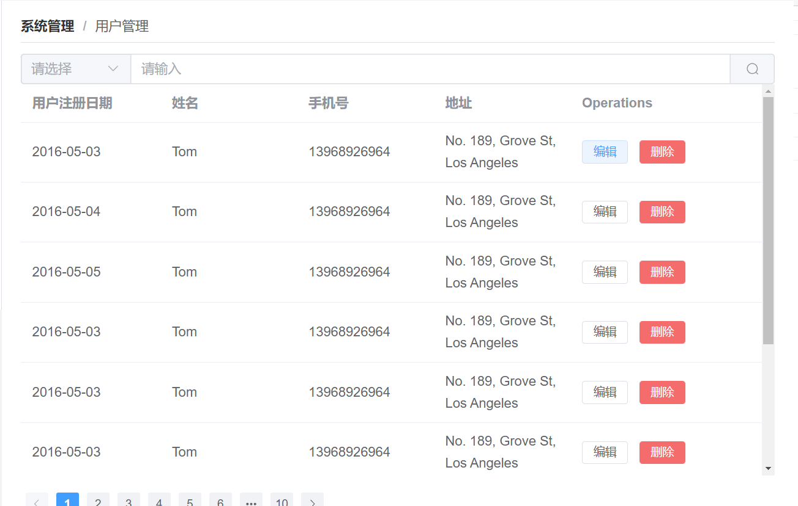
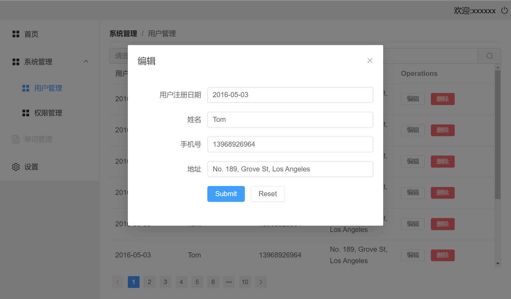
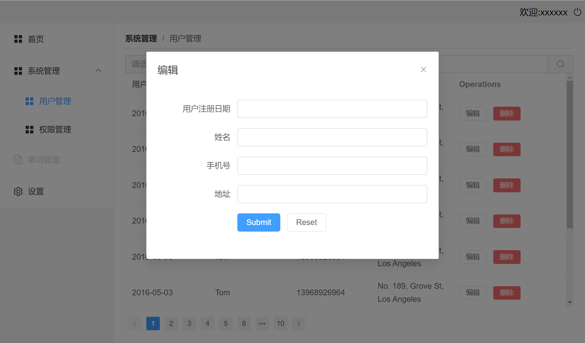

#### Vue3中使用ref和reactive需要注意的点

最近在开发项目中，想到复杂的数据对象都应该用`reactive`，就想用`reactive`来接收父组件传来的值，再通过`emit`传递回去。

但在这遇到了一个坑，用`reactive`来接收对象时，控制台输出没有问题，但页面显示却是空白！

目前要实现的是一个编辑的功能，列表中的数据是通过父组件传递给子组件数据实现的，因为要保证单向数据流，所以当用户点击编辑按钮的时候（即触发`handleEdit`），将从父组件收到的点击的那一条数据存到`form`中。




```typescript
// 对类型进行限制
interface Props {
  barTitle: Array<BarType>, //这里类型不用多了解，就是为了减少维护成本
  tableData: Array<String>
}

// 提供初始值
const props = withDefaults(defineProps<Props>(), {
  barTitle: () => [],
  tableData: () => []
})

// 点击编辑按钮后的模态框
const dialogFormVisible = ref<boolean>(false)
// 选择要编辑的索引值
let indexEdit = ref<number>(0)
// 用来编辑表格数据
let form:any = reactive({})
// 点击编辑按钮的回调
const handleEdit = (index: number, row: User) => {
  dialogFormVisible.value = true
  indexEdit.value = index
  form = props.tableData[index]
  // console.log(index, row)
}
```


```vue
<!-- 弹窗后的页面部分，与上方的页面不是同个代码 这里的props就是每个字段的标题，和表单的数据名相同 -->
    <el-dialog v-model="dialogFormVisible" title="编辑">
      <el-form ref="ruleFormRef" >
        <el-form-item :label-width="formLabelWidth" v-for="item in barTitle" :key="item"
          label="item.name" >
          <el-input v-model="form[item.props]" autocomplete="off" />
        </el-form-item>
        <el-form-item :label-width="formLabelWidth">
          <el-button type="primary" @click="submitForm()">Submit</el-button>
          <el-button @click="resetForm()">Reset</el-button>
        </el-form-item>

      </el-form>
    </el-dialog>
```


当点击了编辑后，理想状态应该是每个数据都会通过`v-model`展示在模态框中，即下图（这里点击的是第一个用户，即`index=0`）




但用`reactive`来做数据代理实际的效果却是：




并没有展示出预想的效果，结果去[官网]([响应式基础 | Vue.js (vuejs.org)](https://staging-cn.vuejs.org/guide/essentials/reactivity-fundamentals.html#limitations-of-reactive))查看了 `reactive`只能进行深度监听，如果修改了第一层的值就会丢失响应！所以才会导致上方的响应丢失。如下代码，我在使用`reactive`在点击编辑的时候将最外层的对象进行的改变，所以导致了丢失响应。

```js
let state = reactive({ count: 0 })

// 上面的引用 ({ count: 0 }) 将不再被追踪（响应性连接已丢失！）
state = reactive({ count: 1 })
```


真正的做法应该是把`let form:any = reactive({})`改为`let form:any = ref({})`后续调用内部数据加上`value`，这样就能正常实现响应式了。于此同时，要是对象或数组嵌套要实现响应式，就推荐用`reactive`，可以实行深度监听。
