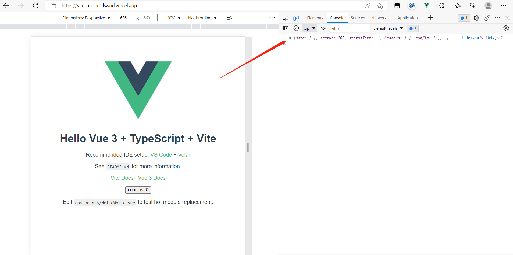

### Vercel的基本介绍

要是用过`hexo`来搭建的博客的话，在`hexo`的官方文档中就有介绍过如何将博客的静态页面搭建到Vercel平台中。但Vercel不仅能搭建静态的页面，也可以将自己github账号中的项目所作的页面进行一个展示，可以省去自己使用服务器搭建的费用。这里只对Vercel基础搭建做一个介绍，想了解更多可以查看官方文档[Introduction to Vercel – Vercel Docs](https://vercel.com/docs)


#### 注册Vercel

进入到[Vercel](https://vercel.com/)登录页面，这里直接连接你的github账号。


因为我早已经连接过了，其他的步骤就无法演示了。根据提示一步步下去到最后出现下面这个页面就成功了。


### 搭建使用vue3+vite所建立的的项目

在`node.js`环境下使用`npm init vite@latest`来创建一个vite项目


这里接下来会有让你选择项目名与框架。如上图可知我目前创建的项目名是`vite-project`使用的框架为vue，并且使用ts语法。

在项目的根目录中使用`npm install`命令导入了vite所需要的包。接下来就是启动项目看看项目页面如何。


vite默认开启了端口号3000。看页面展示无误，接下来就该实现如何将该网页部署到Vercel平台中。

（使用Vercel前需要拥有自己的github账号才行，这里就默认已经都有了github账号）。


使用`npm i -g vercel `在全局安装vercel脚手架。


因为我先前安装过了，这里文字显示的就是我更新了包。（接下来的操作我会在vscode的集成终端中进行，这样可以更加直观）

在vscode集成终端中使用`vercel`对vite项目进行部署


输入后会先让你确认是要部署当前项目，输入y或者按回车即可进行下一步。

第二步则是需要绑定你自己的github账号，因为我先前已经绑定过了就会出现我github的用户名，没有绑定过根据提示一步步进行就好了，绑定过了按回车进行下一步。


然后到`Link to existing project`位置，问你是否要连接已存在的项目，输入n或回车则是不连接，有的话可以和自己github的项目进行绑定。

第四步则会设置你在vercel平台中你的项目名是什么，这里我是默认与我当前项目名同名。

第五步是提示你需要重写你项目这些目前的配置吗？我默认为n，因为当前的vite配置项并没有做任何修改，默认即可。

然后就进入到了部署阶段。


出现`production`就说明项目已经成功部署到vercel平台中，可以复制`Production`的连接来看你项目的页面。


vercel中也会出现页面的相关信息。

#### 解决vercel搭建项目的跨域问题

##### 首先在项目文件中解决跨域问题

根据上方搭建vite项目完成后，目前没有发任何请求所以没出现跨域等问题，接下来我就尝试在项目中发一个ajax请求。


这里我使用`axios`发送了一个网络请求，没有配置代理的情况下会违背同源策略产生跨域问题。


这里要是在本地处理可以使用vite配置项中的`proxy`代理来解决跨域问题


在这里我配置了代理，只要有发送`api`请求并且目标为`https://c.m.163.com`的时候就会启动代理。

同时原先请求中的`https://c.m.163.com`可以删除了。


页面中也没有了跨域请求的报错，可以正常的获取数据了。


接下来就部署到vercel中看看会不会产生跨域的问题。

每当项目修改后在终端中输入`vercel`即可重写上传到vercel平台中。


文件上传可以正常进行，但阅览网页却发现请求报错了。说明vercel并不能因为我们在vite中配置了代理而不产生跨域问题。


##### 配置vercel代理

这里配置代理参考了[vercel 自动化部署项目和跨域问题_小k铁柱的博客-CSDN博客_vercel部署](https://blog.csdn.net/qq_40890601/article/details/120755007)


**需要先在终端`npm i http-proxy-middleware`下载配置所需要的依赖包（重要的事情说三遍！！！）**

**需要先在终端`npm i http-proxy-middleware`下载配置所需要的依赖包（重要的事情说三遍！！！）**

**需要先在终端`npm i http-proxy-middleware`下载配置所需要的依赖包（重要的事情说三遍！！！）**


然后要在根目录创建`vercel.json`配置文件，让vercel知道我们要对其做一些修改。

```json
//vercel.json文件
{
  "rewrites": [ //寻找/api下的文件 然后可以在/api/proxy文件中进行跨域处理
    {
      "source": "/api/(.*)",
      "destination": "/api/proxy"
    }
  ]
 }
```


在根目录中创建`api`文件夹，其中添加`proxy.js`文件（不叫这个也可以，不过使用`proxy`更加语义化）


```javascript
// 该服务为 vercel serve跨域处理
const {
  createProxyMiddleware
  } = require('http-proxy-middleware')
  module.exports = (req, res) => {
  let target = ''
  // 代理目标地址
  // xxxxx 替换为你跨域请求的服务器 如： http://baidu.com
  if (req.url.startsWith('/api')) { //这里使用/api可能会与vercel serverless 的 api 路径冲突，根据接口进行调整
  target = 'https://c.m.163.com' //这里就是在vite中配置的一样
  }
  // 创建代理对象并转发请求
  createProxyMiddleware({
  target,
  changeOrigin: true,
  pathRewrite: {
  // 通过路径重写，去除请求路径中的 `/api`
  '^/api/': '/'
  }
  })(req, res)
  }
```


配置完成后终端使用`vercel`更新代码看看还有没有跨域问题。



发送请求成功，完美解决问题！
