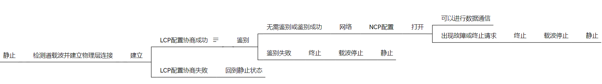

### 3.1数据链路层概述

#### 	链路

​		就是从一个结点道相邻结点的一段物理线路，而中间没有任何其他的交换结点

#### 	数据链路

​		是指把实现通信协议的硬件和软件加道链路上，就构成了数据链路

#### 	数据链路层以帧为单位传输和处理数据

#### 	数据链路层的三个重要问题

​		封装成帧
​		差错检测
​		可靠传输

------

### 3.2封装成帧

#### 	封装成帧是指数据链路层给上层交付的协议数据单元添加帧头和帧尾使之成为帧

​		帧头和帧尾中包含有重要的控制信息
​		帧头和帧尾的作用之一就是帧定界

#### 	透明传输

​		指数据链路层对上层交付的传输数据中没有任何限制，就好像数据链层不存在一样
​		面向字节的物理链路使用字节填充（或称字符填充）的方法实现透明传输
​		面向比特的物理链路使用比特填充的方法实现透明传输

#### 	为了提高帧的传输效率，应当使帧的数据部分的长度尽可能大些

#### 	考虑道差错检测的多种因素，每一种数据链路层协议都规定了帧的数据部分的长度上限，即最大传输单元MTU

------

### 3.3差错检测

#### 	实际的通信链路都不是理想的，比特在传输过程中可能会产生差错：1可能会变成0，而0也可能变成1.这称为比特差错

#### 	在一段时间内，传输错误的比特占所传输比特总数的比率成为误码率BER（Bit Error Rate）

#### 	使用差错检测吗来检测数据在传输过程中是否产生了比特差错，是数据链路层所要解决的重要问题之一

#### 	奇偶校验

​		在待发送的数据后面添加1位奇偶校验位，使整个数据（包括所添加的检验位在内）中“1”的个数为奇数或偶数

​		如果有奇数个位发送无码，则奇偶性发生变化，可以检查出误码
​		如果有偶数个位发生误码，则奇偶性不发生变化，不能检查出误码（漏检）

#### 	循环冗余校验CRC（Cyclic Redundancy Check）

​		收发双方约定好一个生成多项式G（x）
​		发送方基于待发送的数据和生成多项式计算出差错检测码（冗余码），将其添加道待传输数据的后面一起传输
​		接收方通过生成多项式来计算收到的数据是否产生了误码

#### 	检错码只能检测出帧在传输过程中出现了差错，但不能定位错误，因此无法纠正错误

#### 	要想纠正传输中的差错，可以使用冗余信息更多的纠错码进行前向纠错，但纠错码的开销比较大，在计算机网络中较少使用

------

### 3.4.1可靠传输的基本概念

​	无线链路易受干扰，误码率较高，因此要求数据链路层必须向上提供可靠传输服务
​	有线链路的误码率比较低，并不要求数据链路层向上提供可靠传输服务
​	传输差错还包括分组丢失、分组失序以及分组重复

### 3.4.2停止-等待协议SW

​	为解决接收方收不到数据分组，不发送ACK或NAK问题，可以启动一个超时计时器。一般将重传时间选为略大于“从发送方道接收方的平均往返时间”
​	为避免分组重复这种传输错误，必须给每个分组带上序号
​	数据链路层一般不会出现ACK分组迟到情况，因此在数据链路层可以不用给ACK分组编号

#### 	信道利用率

$$
	信道利用率U = TD/TD + RTT + TA\\\\
	TD （发送方发送分组的发送时延）\\\\
	RTT（收发双方的往返时间）\\\\
	TA（接收方发送确认分组所消耗的发送时延）\\\\
$$

### 3.4.3回退N帧协议

#### 	发送窗口的尺寸WT的取值

​		1<WT<=2^n- 1 

#### 	接收窗口的尺寸WR的取值

​		WR=1

#### 	接收方不一定要对收到的数据分组逐个发送确认，可以在收到几个数据分组后，对按序到达的最后一个数据分组发送确认

### 3.4.4选择重传协议SR

#### 	发送窗口的尺寸WT的取值

​		1 < WT <= 2(^n-1)

#### 	接受窗口的尺寸WR的取值

​		WR=WT

#### 	发送方可在未收到接收方确认分组的情况下，将序号落在发送窗口内的多个数据分组发送出去

#### 	接收方可接受未按序到达但没有误码并且序号落在接受窗口的数据分组

#### 	接收方只有在按序接受数据分组后，接受窗口才能向前相应滑动

#### 	发送方对收到的分组进行记录，以防止其相应数据分组的超时重发

------

### 3.5点对点协议PPP

#### 	是目前使用最广泛的点对点数据链路层协议

#### 	在点对点链路传输提供了一个标准方法，主要由三部分构成

##### 		对各种协议数据报的封装方法（封装成帧）

##### 		链路控制协议LCP

​			用于建立、配置以及测试数据链路的连接

##### 		一套网络控制协议NCPs

​			其中的每一个协议支持不同的网络层协议

#### 	帧格式

##### 		帧的首部

###### 			F（1字节）

​				标志（Flag）字段：PPP帧的定界符，取值为0x7E

###### 			A（1字节）

​				地址（Address）字段：取值为0xFF，预留（目前没有什么作用）

###### 			C（1字节）

​				控制（Control）字段：取值为0x03，预留（目前没有什么作用）

###### 			P（2字节）

​				协议（Protocol）字段：指明帧的数据部分送交给哪个协议处理
$$
取值0x0021表示：帧的数据部分为IP数据报\\\\
取值0xC021表示：帧的数据部分为LCP分组\\\\
取值0x8021表示：帧的数据部分为NCP分组
$$

##### 		帧的数据部分

​			不超过1500字节

##### 		帧的尾部

###### 			FCS（2字节）

​				帧校验序列（Frame Check Sequence）字段：CRC计算出的校验位

#### 	解决透明传输

##### 		数据部分出现帧首或帧尾中的标志字段时

##### 		面向字节的异步链路

​			采用字节填充法（插入转义字符）

##### 		面向比特的同步链路

​			采用比特填充法（插入比特0）

#### 	工作状态

##### 		

------

### 3.6.1媒体接入控制的基本概念

#### 	共享信道要着重考虑的一个问题就是如何协同多个发送和接收站点对一个共享传输媒体的占用，即媒体接入控制MAC（Medium Access Control）

#### 	媒体接入控制

##### 		静态划分信道(预先固定分配好信道，这类方法非常不灵活，对于突发性数据传输信道利用率会很低。
通常在无线网络的物理层中使用)

​			频分多址
​			时分多址
​			码分多址

##### 		动态接入控制

###### 			受控接入（已被淘汰）

​				集中控制
​				分散控制

###### 			随机接入:

​				所有站点通过竞争，随机在信道上发送数据。如果恰巧由两个或更多站点在同一时刻发送数据，则信号在共享媒体上就要产生碰撞。使得这些站点都发送失败。因此，这类协议要解决的问题是如何避免冲突以及在发送冲突后如何尽快恢复通信。著名的共享式以太网采用的就是随机接入

#### 	类比

### 3.6.2静态划分信道

#### 	信道复用

##### 		频分复用FDM

​			频分复用的所有用户同时占用不同的频带资源并行通信

##### 		时分复用TDM

​			所有用户在不同的时间占用同样的频带宽度

##### 		波分复用WDM

##### 		码分复用CDM

##### 		使用CDMA的每一个站被指派一个唯一的m bit码片序列

###### 			一个站如果要发送比特1，则发送它自己的m bit码片序列

###### 			一个站如果要发送比特0，则发送它自己的m bit码片序列的二进制反码

###### 			码片序列挑选原则

​				码片序列必须各不相同
​				码片序列必须相互正交（规格化内积为0）
​	
$$
S表示站S的码片序列，T表示其他任何站的码片序列\\\\
					S * T = 0\\\\
					S * S = 1\\\\
					S * 相反T = 0\\\\
					S * 相反S = -1
$$

### 3.6.3CSMA/CD协议

#### 	载波监听多址接入/碰撞检测 CSMA/CD(Carrier Sense Multiple Access/Collision Detection)

##### 		多址接入MA

​			多个站连接在一条总线上，竞争使用总线

##### 		载波监听CS

​			每一个站在发送帧之前要先检测一下总线上是否由其他站点在发送帧
​				若检测到总线空闲96比特时间，则发送这个帧
​				若检测到总线忙，则继续检测并等待总线转为空闲96比特时间，然后发送这个帧

##### 		碰撞检测CD

​			每一个正在发送的站边发送边检测碰撞
​				一旦发现总线上出现碰撞，则立即停止发送，退避一段随机事件后再次发送

#### 	争用期（碰撞窗口）

​		以太网端到端往返传播时延2τ称为争用期
​		主机最多经过2τ的时长就可以检测到本次发送是否遭受了碰撞
​		共享式以太网不能连接太多的主机，使用的总线也不能太长

#### 	以太网规定最小帧长为64字节（512比特时间即为争用期）

#### 	截断二进制指数退避算法

$$
退避时间 = 基本退避时间（争用期2τ） × 随机数r\\\\（r从离散的整数集合{0,1,...,(2^k-1)}中随机选出一个数\\\\k = Min[重传次数,10]）
$$

​		可使重传需要推迟的平均时间随重传次数而增大，因而减小发生碰撞的概率

#### 	信道利用率

$$
发送一帧占用总线的时间为T0+τ，帧本身发送的时间为T0\\\\
		极限信道利用率Smax = T0/T0 + τ
$$

### 3.6.4CSMA/CA

#### 	802.11无线局域网使用CSMA/CA协议，在CSMA的基础上增加了一个碰撞避免CA功能

#### 	802.11标准还使用了数据链路层确认机制（停止等待协议）来保证数据被正确接收

#### 	802.11的MAC层标准定义了两种不同媒体的接入控制方式

​		分布式协调功能DCF
​		点协调功能PCF

#### 	802.11规定，所有站点必须在持续检测到信道空闲一段指定时间后才能发送帧，这段时间被称为帧间间隔IFS

##### 		常用帧间间隔

​			短帧间间隔SIFS(28微妙)
​			DCF帧间间隔DIFS(128微秒)

#### 	退避算法

​		当站点检测到信道使空闲，并且所发送的数据帧不是成功发送完上一个数据帧之后立即连续发送的数据帧，则不使用退避算法

##### 		以下情况必须使用退避算法

​			在发送数据帧之前检测到信道处于忙状态时
​			在每一次重传一个数据帧时
​			在每一次成功发送后要连续发送下一个帧时（避免长时间占用信道）

##### 		在执行退避算法时，站点为退避计时器设置一个随机的退避时间

​			当退避计时器的时间减小到零时，就开始发送数据
​			当退避计时器的时间还未减小到零时而信道又转变为忙状态，则冻结计时器，等重新变为空闲，再经过时间DIFS后，继续启动退避计时器
​		在进行第i次退避时，退避时间在时隙编号**{0, 1 , ... , 2^(2+i) - 1 }**中随机选择一个，然后乘以基本退避时间（一个时隙的长度）就可以得到随机的退避时间。当时隙编号到达**255**时（对应于第6次退避）就不再增加了

#### 	信道预约

​		源站在发送数据帧之前先发送一个短的控制帧，称为请求发送QTS,它包括源地址，目的地址以及这次通信（包括相应的确认帧）所需的持续时间
​		若目的站正确收到源站发来的RTS帧，且媒体空闲，就发送一个响应控制帧，称为允许发送CTS
​		源站收到CTS后，等一段SIFS后，就可发送其数据帧
​		若目的站正确收到源站发来的数据帧，在等待时间SIFS后，就向源站发送确认帧ACK

##### 		802.11规定了3中情况供用户选择

​			使用RTS帧和CTS
​			不使用RTS帧和CTS
​			只有当数据帧长度超过某一数值时才使用RTS帧和CTS

#### 	虚拟载波监听机制

​		除RTS帧和CTS帧会携带通信需要持续的时间，数据帧也能携带通信需要的时间

------

### 3.7MAC地址、IP地址、以及ARP协议

#### 	MAC地址

##### 		是以太网的MAC子层所使用的地址

##### 		每个主机发送的帧中必须携带标识发送主机和接受主机的地址。由于这类地址是用于媒体接入控制MAC（Media Access Control），所以这类地址被称为MAC地址

##### 		MAC地址也被称为硬件地址

##### 		是对网络各接口的唯一标识，而不是对网络上各设备的唯一标识

##### 		组织唯一标识符OUI（由IEEE的注册管理机构分配）（在前三个字节）

###### 			第一字节b0比特

​				为1表示多播
​				为0表示单播

###### 			第一字节b1比特

​				为1表示本地管理
​					剩余46位全为1时，就是广播地址FF-FF-FF-FF-FF-FF
​				为0表示全球管理
​		字节发送顺序：第一字节》》》第六字节
​		字节内比特发送顺序：b0》》》b7

#### 	IP地址

##### 		是TCP/IP体系结构网际层所使用的地址

##### 		网络编号

​			标识因特网上数以百万计的网络

##### 		主机编号

​			标识同一网络上不同主机（或路由器各接口）

##### 		数据包转发过程中源IP地址和目的IP地址保持不变

##### 		数据包转发过程中源MAC地址和目的MAC地址逐个链路（或逐个网络）改变

#### 	ARP协议

​		属于TCP/IP体系结构网际层，其作用是已知设备所分配到的IP地址，使用ARP协议可以通过该IP地址获取到设备的MAC地址

##### 		ARP高速缓存记录类型

###### 			动态

​				自动获取，生命周期默认为两分钟

###### 			静态

​				手工设置，不同操作系统下的生命周期不同

------

### 3.8集线器与交换机的区别

#### 	集线器

​		在以太网逻辑上仍然时一个总线网，使用CSMA/CD协议
​		只工作在物理层，它的每个接口仅简单地转发比特，不进行碰撞检测（由各站的网卡检测）
​		集线器一般都有少量的容错能力和网络管理能力

#### 	交换机

​		通常都有多个接口
​		一般工作在全双工方式
​		能同时连通多对接口，无碰撞（不使用CSMA/CD协议）
​		工作在数据链路层（也包括物理层），它收到帧后，在帧交换表中查找帧的目的MAC地址所对应的接口号，然后通过该接口转发帧
​		内部的帧交换表时通过自学习算法自动地逐渐建立起来

##### 		帧两种转发方式

​			存储转发

​			**等待后续补充**

------

### 3.9以太网交换机自学习和转发帧的流程

#### 	收到帧机型登记。登记内容为帧的源MAC地址以及进入交换机的接口号

#### 	根据帧的目的MAC地址和交换机的帧交换表对帧进行转发

##### 		明确转发

​			交换机知道应当从哪个接口转发该帧（单播、多播、广播）

##### 		盲目转发

​			交换机不知道应当从哪个端口转发帧，只能将其通过除进入交换机的接口外的其他所有接口转发（也称为泛洪）

##### 		明确丢弃

​			交换机知道不应该转发该帧，将其丢弃

#### 	帧交换表中的每条记录都有自己的有效时间，到期删除，原因如下

​		交换机的接口改接了另一台主机
​		**等待后续补充**

------

### 3.10以太网交换机的生成树协议STP

#### 	添加冗余链路可以提高以太网的可靠性，但是冗余链路会形成网络环路

##### 		网络环路会带来的问题

###### 			广播风暴

​				大量消耗网络资源，使得网络无法正常转发其他数据帧

###### 			主机收到重复的广播帧

​				大量消耗主机资源

###### 			交换机的帧交换表震荡（漂移）

​	交换机使用生成树协议STP，可以在增加冗余链路提高网络可靠性的同时又避免网络环路带来的各种问题
​	交换机都能够自动计算并构建出一个逻辑上没有环路的网络，其逻辑拓扑结构必须时树形（无逻辑环路）
​	最终生成的树形逻辑拓扑要确保连通整个网络
​	当首次连接交换机或网络物理拓扑发生变化时（有可能时人为改变或故障），交换机都将进行生成树的重新计算

------

### 3.11虚拟局域网VLAN

#### 	概述

##### 		网络中会频烦出现广播信息

​			地址解析协议ARP
​			路由信息协议RIP
​			动态主机配置协议DHCP
​			NetBEUI
​			IPX/SPX
​			Apple Talk

##### 		分割广播域方法

###### 			使用路由器（成本较高）

###### 			虚拟局域网

​				是一种将局域网内的设备划分成与物理位置无关的逻辑组的技术，这些逻辑组具有某些共同的需求

#### 	实现机制

##### 		IEEE 802.1Q帧（也称Dot One Q帧）

###### 			对以太网MAC帧格式进行了扩展，插入4字节的VLAN标记

###### 			VLAN标记的最后12比特称为VLAN标识符VID，它唯一地标志了以太网帧属于哪个VLAN

​				VID取值范围0~4095（0~2^12-1）
​				0和4095都不用来表示VLAN，因此用于表示VLAN的VID的有效取值范围是1~4094

###### 			IEEE 802.1Q帧是由交换机来处理，而不是用户主机，用户主机无法识别IEEE 802.1Q帧

​				当交换机收到普通的以太网帧时，会将其插入4字节的VLAN标记转变为802.1Q帧，简称“打标签”
​				当交换机转发802.1Q帧时，可能会删除其4字节VLAN标记转变为普通以太网帧，简称“去标签”

##### 		交换机的端口类型

###### 			Access

​				一般用于连接用户计算机
​				只能属于一个VLAN
​				PVID值与端口所属VLAN的ID相同（默认为1）
​				接收处理方法
​					一般只接收“未打标签”的普通以太网MAC帧。根据接收帧的端口PVID给帧“打标签”，即插入4字节VLAN标记字段，字段中的VID取值与端口的PVID取值相等
​				发送处理方法
​					若帧中的VID与端口的PVID相等，则“去标签”并转发该帧；否则不转发。

###### 			Trunk

​				一般用于交换机之间或交换机与路由器之间的互连
​				可以属于多个VLAN
​				用户可以设置Trunk端口的PVID值。默认情况下，Trunk端口的PVID值为1
​				接收处理方法
​					对VID等于PVID的帧，“去标签”再转发
​					对VID不等于PVID的帧，直接转发
​				发送处理方法
​					接收“未打标签”的帧，根据接收帧的端口的PVID帧给帧“打标签”，即插入4字节VLAN标记字段，字段中的VID取值与端口的PVID取值相等
​					接收“已打标签的帧”

###### 			Hybrid

​				绝大部分与Trunk端口相同
​				端口发送处理方法（与Trunk不同）
​					查看帧的VID是否再端口的“去标签”列表中
​						存在
​							“去标签”后转发
​						不存在
​							若不存在，则直接转发

##### 		交换机各端口的缺省VLAN ID

​			思科交换机上称为Native VLAN，即本征VLAN
​			华为交换机上称为Port VLAN ID，简称为PVID

