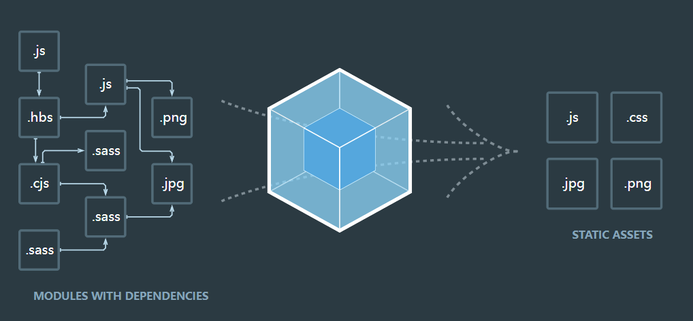

`Webpack`就是将浏览器识别不了的文件转换为浏览器能识别的文件

#### `webpack4`的安装（以下全以webpack4版本进行，之后再用webpack5进行比较）

**在安装`webpack`前要确保电脑已经安装了`node.js`**

`npm i webpack@4 -D -g`是全局安装开发者模式的`webpack`其中`-g`代表全局安装`-D`代表开发者模式

`npm i webpack-cli@3 -D -g`是全局安装开发者模式的`webpack-cli`其中`-g`代表全局安装`-D`代表开发者模式

其他的安装与上同理

如果想局部安装就去掉`-g`即可。


全局运行`webpack`可以直接在命令行输入`webpack`就可进行打包

没有全局安装，但局部安装了。局部运行`webpack`需要在命令行输入`npx webpack`才能进行打包

#### `webpack`的配置文件

`webpack.config.js`为`webpack`的配置文件，当运行webpack会加载里面的配置


```javascript
//webpack.config.js 模块化默认采用采用commonjs
//resolve用来拼接绝对路径的方法
const { resolve } = require('path')
module.exports = {
    //webpack配置
    //入口，webpack的打包起点文件
    entry: './src/index.js',
    //输出
    output: {
        //输出文件名
        filename: 'built.js',
        //输出路径
        //__dirname是node.js的变量，代表当前文件的目录绝对路径
        path: resolve(__dirname,'bulid')
    },
    //loader的配置
    module: {
    rules: [
    	//详细loader配置  不同文件必须配置不同loader处理
        {
            //text匹配哪些文件
            test: /\.css$/,//这里解析css资源
            //use使用哪些loader进行处理
            use: [
                //use数组中loader执行顺序：从右到左，从下到上依次执行
                //创建style标签，将js中的样式资源插入进行，添加到head中生效
                'style-loader',
                //将css文件变成common.js模块加载js中，里面内容是样式字符串
                'css-loader'
            ]
        }
      ]
	},
    //plugins的配置
    plugins: [],
    //模式
    mode: 'development'//开发模式
    //mode: 'production' 是生产模式，会对代码进行压缩
}
```

配置解析`less`文件的`loader`

**在loader文件中如果使用的webpack是4的版本则下载的loader版本也需要旧版本**

```javascript
//webpack.config.js
module: {
    rules: [
        {
            test: /\.less$/,
            use: [
                'style-loader',
                'css-loader',
                //将less文件编译成css文件，然后依次编译为样式
                //打包前需要使用npm下载 less-loader和less
                'less-loader'
            ]
        }
      ]
	}
```

##### 打包html资源

只需在`plugins`中配置 `html-webpack-plugin`即可，打包自动引入打包输出的所有资源


```javascript
//webpack.config.js
const HtmlWebpackPlugin =require('html-webpack-plugin')//html-webpack-plugin需要通过npm下载
module.exports = {
    plugins: [
    new HtmlWebpackPlugin({
       		 //复制'./src/index.html'文件，并自动引入打包所有资源
    		template: './src/index.html' 	
    	})
	]
}

```


##### 打包图片资源

在`loader`中进行配置

要是报错大部分只需根据下载依赖包即可

```javascript
//webpack.config.js
module: {
    rules: [
        {
            //这种处理方式只能处理index.js中引入的图片资源
            test: /\.(jpg|png|gif)$/,
            loader: 'url-loader',
            options:{
                //表示图片大小小于8kb，就会被base64处理
                limit: 8 * 1024
                //要是解析出现路径变为:[object Module]，需要关闭es6模块化，使用commonjs解析
                esModule: false,
                //表示输出到根目录的imgs的文件夹中
                outputPath: 'imgs'
            }
        },
        {
            test: /\.html$/,
            //这是处理Html文件的img图片
            loader: 'html-loader'
        }
      ]
	}
```


##### 打包其他资源

需要在`loader`中进行配置

和打包图片资源方法几乎一致

```javascript
//webpack.config.js
module: {
    rules: [
        {
            //表示排除css/js/html资源
            exclude: /\.(css|js|html)$/,
            loader: 'file-loader',
            //表示输出到根目录的media的文件夹中
                outputPath: 'media'
        }
      ]
	}
```


##### devServer

可以实现自动化（自动编译已修改的文件，自动打开浏览器，自动刷新浏览器）


```javascript
//webpack.config.js
//devServer启动指令 npx webpack-dev-server
const { resolve } = require('path')
module.exports = {
    devServer: {
        contentBase: resolve(__dirname, 'build'),
        //启动gzip压缩
        compress: true,
        //开启的端口号
        port: 3000,
        //自动打开默认浏览器
        open: true
    }
}
```


##### 提取`css`为单独资源

用上方的方法打包`css`资源则会存在`js`文件中需要使用`npm i mini-css-extract-plugin -D`来进行安装，然后在`webpack.config.js`进行配置即可


```javascript
//webpack.config.js
const MiniCssExtractPlugin = require('mini-css-extract-plugin')
module.exports = {
    module:{
        rules: [
        {
            test: /\.css$/,
            use: [
                //用这个loader来代替style-loader
                MiniCssExtractPlugin.loader,
                'css-loader',
            ]
        }
      ]
    },
    plugins: [
        new MiniCssExtractPlugin({
            //对输出的css文件进行重命名
            filename: './src/index.html'
        })
    ]
}
```


##### `js`语法检查`eslint`

语法检查用于检查语法错误和保证团队风格一致

这里使用`airbnb`来作为检查规则，需要安装`npm i eslint-loader eslint-config-airbnb-base eslint-plugin-import -D`

```javascript
//webpack.config.js
module.exports = {
    module: {
        rules:[
            {
                //eslint只检查自己写的源代码
                test: /\.js$/,
                exclude: /node_modules/,//排除检查库
                loader: 'eslint-loader',
                options: {
                    fix: true //可以自动修复eslint错误
                }
            }
        ]
    }
}
```


##### `eslint`兼容性处理

为保证在任何浏览器都能运行需要对`js`做兼容性处理

需要安装`npm i babel-loader @babel/core @babel/preset-env core-js -D `

```javascript
//webpack.config.js
module.exports = {
    module: {
        rules:[
            {
                //eslint只检查自己写的源代码
                test: /\.js$/,
                exclude: /node_modules/,//排除检查库
                loader: 'babel-loader',
                options: {
                    //预设：指示babel做怎么样的兼容性处理
                    presets:[
                        [
                            '@babel/preset-env',
                            {	//按需加载
                                useBuiltIns: 'usage',
                                corejs:{
                                    version:3//指定core-js把呢不能
                                },
                                targets: {//指定兼容性做到哪个版本浏览器
                                    chrome: '60,
                                    firefox: '60
,                               }
                            }
                        ]
                    ]
                }
            }
        ]
    }
}
```


#### `webpack`优化配置


##### `HMR`热模块替换

在开发环境中，一个模块发生变化，只会重新打包发生变化的模块

`html`文件和`js`文件默认不能使用 `HMR`，因为开发都是单页面应用，所以没必要开启`html`的热更新


```javascript
//webpack.config.js
module.exports = {
    entry:['./src/js/index.js' ],
    devServer: {
        //开启HMR功能
        hot: true
    }
}
```


```javascript
//index.js文件  这种方法不能处理入口文件
if(module.hot) {
    //一旦 module.hot 为 true， 说明开启了HMR功能
    module.hot.accept('./print.js',function(){
        //方法会监听 print.js 文件的变化，一旦发生变化，其他模块不会重新打包构建
        //会执行后面的回调函数
        print()
        //修改./print.js信息，只有该文件重新构建了
    })
}
```


##### `source-map`

提供源代码到构建后代码映射技术（如果构建后代码出错了，通过映射可以追踪源代码错误）


```javascript
//webpack.config.js
module.exports = {
    devtool: 'source-map'//这样就开启了source-map
}
```


`source-map`的模式：

- `source-map`：单独生成一个以`.map`为后缀的文件,发生错误能表明是哪个文件和源代码的错误位置
- `inline-source-map`：直接在入口`js`文件中生成,发生错误能表明是哪个文件和源代码的错误位置
- `hidden-source-map`：单独生成一个以`.map`为后缀的文件，发生错误显示原因，但没有源代码错误位置
- `eval-source-map`：直接在入口`js`文件中生成,发生错误能表明是哪个文件和源代码的错误位置（为hash值）
- `nosources-source-map`：单独生成一个以`.map`为后缀的文件，能找到错误信息，但是没有源代码信息
- `cheap-source-map`：单独生成一个以`.map`为后缀的文件，能找到错误信息，但源代码错误信息只能精确到行
- `cheap-module-source-map`：单独生成一个以`.map`为后缀的文件，能找到错误信息和源代码的错误位置


##### 缓存

在生产环境中，对一个文件进行修改为了不需要所有文件都重新构建一次，就需要用到缓存

主要使用：

- `cacheDirectory: true`
- 文件名中添加`contenthash`

```javascript
//webpack.config.js
module.exports = {
    output:{
        //这里增加contenthash值是因为保证重新构建文件发生改变，可以重新写入缓存
        //contenthash：根据文件的内容生成hash值。
        filename: 'js/built[contenthash:10].js'
    },
     //loader的配置
    module: {
    rules: [
    	{
            test: /\.js$/,
            exclude: /node_modules/,
            loader: 'babel-loader',
            options: {
                //开启babel缓存，第二次构建时，会读取之前的缓存
                cacheDirectory: true
            }
        }
      ]
	}
}
```


##### 代码分割

通过`code split`可以更好的进行代码维护

```javascript
//webpack.config.js
module.exports = {
    //可以将node_modules中代码单独打包成一个chunk
    optimization: {
        splitChunks: {
            chunks: 'all'
        }
    }
}
```

在`index.js`入口文件中实现代码分割

```javascript
//index.js文件
//import动态导入语法  能将某个文件单独打包 /* webpackChunkName: 'test' */代表打包后文件名为test
import(/* webpackChunkName: 'test' */'./test')//使用promise方法
.then(()=>{
    console.log('文件加载成功')
})
.catch(()=>{
    console.log('文件加载失败')
})
```


##### 懒加载和预加载


```javascript
//index.js文件
//放在按钮中当点击的时候才会加载test.js文件
document.getElementById('btn').onclick = function() {
    //正常加载可以认为是并行加载（同一时间加载多个文件）
    //webpackPrefetch: true表示启动预加载，预加载是指等其他资源加载完毕，浏览器空闲了再加载资源
    import(/* webpackChunkName: 'test', webpackPrefetch: true */'./test')//使用promise方法
.then(()=>{
    console.log('文件加载成功')
})
.catch(()=>{
    console.log('文件加载失败')
})
}
```


##### `dll`

`dll`可以对第三窟进行单独打包，它的配置需要单独新建一个配置文件

运行打包需要使用`webpack --config webpack.dll.js`告诉`webpack`配置文件名变更了


```javascript
//webpack.dll.js文件
//获取路径
const { resolve } = require('path')
//引入插件
const webpack = require('webpack')

module.exports = {
    entry: {
        //['jquery']表示要打包的库是jquery
        jquery: ['jquery']
    },
    output: {
        //最终打包生成的[name]是jquery
        filename: '[name].js',
        path: resolve(__dirname, 'dll'),
        library: '[name]_[hash]'//打包的库向外暴露的内容叫什么名字
    },
    plugins: [
        //打包生成一个manifest.json，提供和jquery映射关系
        new webpack.DllPlugin({
            name: '[name]_[hash]', //映射库的暴露内容名称
        	path: resolve(__dirname, 'dll/manifest.json') //输出文件路径
        })
    ]
}
```


同时需要在配置文件中告诉`webpack`哪些库不参与打包，并安装插件来让`html`自动引入资源`npm i add-asset-html-webpack-plugin -D`


```javascript
//webpack.config.js文件
const { resolve } = require('path')
const webpack = require('webpack')
const AddAssetHtmlWebpackPlugin = require('add-asset-html-webpack-plugin')
module.exports = {
    plugins: [
        //告诉webpack哪些库不参与打包
        new webpack.DllReferencePlugin({
            manifest: re3solve(__dirname, 'dll/manifest.json')
        }),
        //让html自动引入资源
        new AddAssetHtmlWebpackPlugin({
            filepath: resolve(__dirname, 'dll/jquery.js')
        })
    ]
}
```


##### 解决跨域问题


```javascript
//webpack.config.js文件

module.exports = {
    devServer: {
        //使用服务器代理来解决开发环境的跨域问题
        proxy: {
            //一旦devServer服务器接收到 /api/xxx 的请求，就会把请求转发到另一个服务器
            '/api' : {
                target: 'http://localhost:3000'
            }
        }
    }
}
```


##### 解决缓存失效问题

在原先的方法中，因为新增加`hash`值，其他文件修改会导致`hash`值变更也会修改主要入口文件`index.js`中的数据，导致重新打包后入口文件也会进行打包，这时就需要`runtimeChunk`配置来解决这个问题


```javascript
//webpack.config.js文件

module.exports = {
    optimization: {
        //将当前模块的记录其他模块的hash单独打包成一个文件 runtime
        runtimeChunk: {
            name: entrypoint => `runtime-${entrypoint.name}`
        }
    }
}
```

