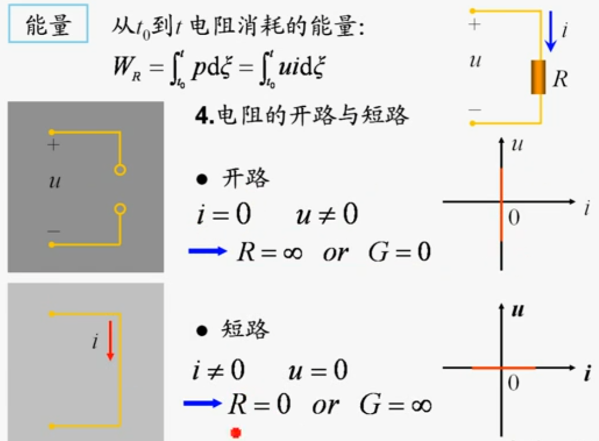
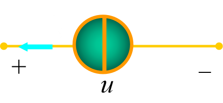

<meta name="referrer" content="no-referrer"/>

### 电路和电路模型

> 电路是由电路零件、器件经导线连接而成的电通路装置。
>
> - 电路零件常称为电路部件（例如电阻器、开关、蓄电池等）；
> - 电路器件则是由电路部件组成且具有某种功能的产品（如晶体管、集成电路等）；
>
> 在电路中所产生的电压、电流是在电源的作用下产生的，因此电源又称为激励源或激励；由激励在电路中产生的电压、电流等称为响应。

#### 电路模型

电路模型

图片中左侧为简单的实际电路，由若干个干电池和小灯泡组成，右侧为电路模型，反映了将嗲能转换为热能和光能的物理现象；用理想电路元件或它们的组合模拟实际器件就是建立其模型，简称**建模**。

#### 电流和电压的参考方向

> 电路理论中将电流（I）、电压（U）、电荷（Q）和磁通（Φ）来进行表示。磁通链用ψ进行表示。电功率和电能量分别用P和W。
>
> 在电路分析中，需指定电流或电压的参考方向后才能开始进行分析和计算。

在上图中规定了A到B电流i的方向为A->B，若实际电流方向和参考方向一致，则电流为正值，即`i>0`；若参考方向和实际方向不一致，即`i<0`。这样在指定的电流参考方向下，电流值的正负就可以反映除电流的实际方向，如下图所示。

同理，对电路两点之间的电压也要指定参考方向或参考极性。在表达两点之间的电压时，用正极性（+）表示高电位，负极性（-）表示低点位，而正极指向负极的方向就是电压的参考方向，如下图，若电压实际方向和参考方向相同，则`U>0`，若电压实际方向和参考方向相反，则`U<0`。

#### 关联参考方向

> 一个元件的电流和电压的参考方向可以独立地任意指定。如果指定流过元件的电流参考方向和电压的参考方向一致，则成为**关联参考方向**，当两者不一致时，称为**非关联参考方向**，如下图所示。

#### 电路单位制

在国际单位制（SI）中，电流的单位为A（安培，简称安），电荷的单位为C（库伦，简称库），电压的单位为V（伏特，简称伏），磁通链的单位为Wb（韦伯，简称韦）。

### 电功率和能量

> 电功率与电压和电流密切相关。当正电荷从元件上电压的`+`极经元件运动到电压的`-`极时，与此电压相应的电场力要对电荷做功，这时，元件**吸收能量**；反之为**释放电能**。

在dt时间内，有dq电荷自元件上电压的`+`极经历电压u到电压的`-`极。根据电压的定义（A、B两点的电压u等于电场力将单位正电荷自A电移动至B点时所做的功），电场力所做功，也即元件吸收的能量为：
$$
dW =udq
$$
假设电流`i`在元件上与`u`成关联方向，由`i`的定义`i=dq/dt`（即`q`对`t`求导），由`dW = uidt`，功率是能量对时间的导数，故元件的吸收功率为
$$
p=\frac{dW}{dt}=ui
$$
在`t_0`到`t`的时间内，元件吸收能量为
$$
W(t)=\int dW = \int_{q(t_0)}^{q(t)}udq=\int_{t_0}^t u(\xi)i(\xi)d\xi
$$
由于`u`、`i`都是代数量，因此，功率p和吸收的能量W也都是代数量。当最后结果`p>0`，`W>0`，元件确实吸收功率与能量；当`p<0`，`w<0`时，元件实际释放电能或发出功率。

在电路中，通常将电流单位为`A`，电压的单位为`V`时，能量的单位为`J`，当时间的单位为`s`，功率的单位为`W`，来进行运算。

#### 电路吸收或发出功率判断

当由元件所吸收功率，则记为`+`，且`ui`关联（即电流和电压方向相同），也记为`+`，则最后元件所吸收功率为`P= ++ui`。如上图所示。若`P>0`，则参考吸收则实际吸收，`P<0`则参考吸收，实际发出（即大于零就取参考的，小于零取相反的）。（对于完整的电路而言，吸收的功率一定等于发出的功率）

### 电路元件

> 电路元件是电路中最基本的组成单元。电路元件通过其端子与外部连接。
>
> **电阻元件**的元件特性是电压`u`与电流`i`的代数关系`f(u,i)=0`;**电容元件**的元件特性是电荷`q`与电压`u`的代数关系`f(q,u)=0`;电感元件的元件特性是磁通链`ψ` 与电流`i`的代数关系`f(ψ,i)=0`。这三种特性称之为元件的伏安特性、库伏特性和韦安特性。
>
> 电路元件按与外部连接的端子数目可分为二端、三端、四端元件等。
>
> **电源是由正极流出，负极流入，电阻则是正极流入，负极流出。**

**注意：**

如果表征元件端子特性的数学关系式是线性关系，该元件称为线性元件，否则成为非线性元件。

### 电阻元件

> 线性电阻元件在理想情况下：在电压和电流取关联参考方向时，在任何时刻它两端的电压和电流服从欧姆定律

$$
欧姆定律：u=Ri
$$

R:电阻元件的参数，称为元件的电阻。R是一个正实常数。

当电压单位为`V`，电流单位为`A`时，电阻的单位为`Ω`（欧姆，简称欧）。

$$
令：G=\frac{1}{R} \\得：i=Gu
$$
在上式中称`G`为电阻元件的电导，单位`S`(西门子，简称西)。`R`和`G`都是电阻元件的参数。

若电压、电流参考方向取非关联参考方向，则
$$
u=-Ri 或i=-Gu
$$
**欧姆定律注意点：**

- 只适用于线性电阻（R为常数）；
- 如电阻上的电压与电流参考方向非关联，公式中应冠以负号；
- 说明线性电阻是无记忆、双向性的元件。

#### 开路和短路

当电流`i=0`，电压`u`任意时，称为“开路”。此时伏安特性在`u-i`平面上与电压轴重合，相当于电阻`R=∞`或电导`G=0`。短路则相反。

### 电压源和电流源

#### 理想电压源

定义：电压源两端电压总能保持定值或一定的时间函数，其值与流过他的电流i无关的元件叫理想电压源。电压源符号如图所示。

电压源的端电压为：
$$
u(t) =u_{s}(t)
$$
电压源的电压与通过元件的电流无关，总保持为给定的时间函数，而电流的大小则由外电路决定。

由上图得电流公式：
$$
i=\frac{u_{s}}{R}
$$

#### 理想电流源

定义：其输出电流总能保持定值或一定的时间函数，其值与它的两端电压u 无关的元件叫理想电流源。符号如图所示。

电流源的输出电流由电源本身决定，与外电路无关；与它两端电压方向、大小无关。与电压源正好相反。

由于电流源无法确定两端的电压，需要通过外电路的情况来确定电压。可以由下图的电路来简单计算并了解下电流源。

根据欧姆定律此时电压的公式应为：
$$
u= Ri_{S}
$$

### 受控电源

> 定义：电压或电流的大小和方向不是给定的时间函数，而是受电路中某个地方的电压(或电流)控制的电源，称受控源。
>
> 受控电压源或受控电流源视控制量是电压还或电流可分为电压控制电压源（VCVS，voltage control voltage source），电压控制电流源（VCCS，voltage control current source），电流控制电压源（CCVS）及电流控制电流源（CCCS）四种。

算受控源一般需要通过控制的参数来进行计算。

### 霍尔霍夫定律

> 基尔霍夫定律包括基尔霍夫电流定律（KCL）和基尔霍夫电压定律( KVL )。它反映了电路中所有支路电压和电流所遵循的基本规律，是分析集总参数电路的基本定律。基尔霍夫定律与元件特性构成了电路分析的基础。

在了解霍尔霍夫定律前先要了解**支路、节点和回路的概念**，图中以常用为准。

支路（branch）：支路有两个概念，一个是电路中每一个两端元件就叫一条分支，和电路通过同一电流的分支（常用）。

节点（node）：节点有两个概念，一个是元件的连接点称为节点，和三条以上支路的连接点称为节点（常用）。

路径：两结点间的一条通路。

回路（loop）：由支路组成的闭合路径。

网孔（mesh）：内部不含任何支路的回路。

#### 基尔霍夫电流定律（KCL）

> 在集总电路中，任意时刻，对任意结点流出（或流入）该结点电流的代数和等于零。

$$
\sum i_{入}=\sum i_{出}
$$

图上运用KCL可得：
$$
i_1 + i_2 = i_3 + i_4 + i_5
$$

#### 基尔霍夫电压定律（KVL）

> 在集总参数电路中，任一时刻，沿任一回路，所有支路电压的代数和恒等于零。

$$
\sum u_{降}=\sum u_{升}
$$

主要公式运用就是标定各元件电压参考方向，并选定回路绕行方向是顺时针还逆时针。

如图所示，可得公式：
$$
-U_1 + -U_{S1} + U_2 + U_3 + U_4 + U_{S4} = 0
$$
**注：KVL也适用于电路中任一假想的回路。**
