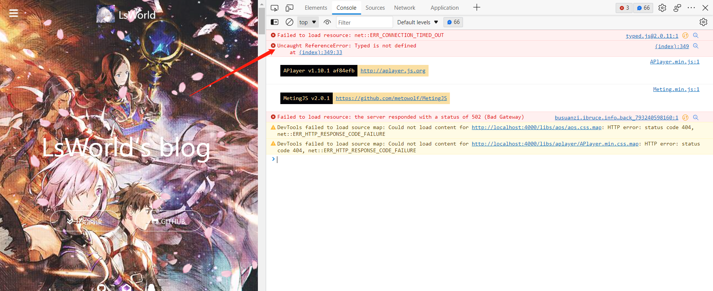
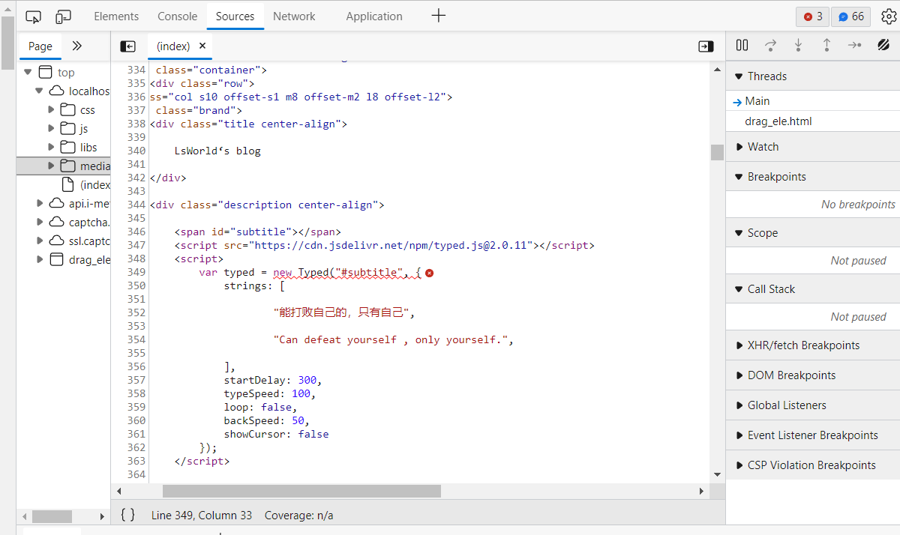
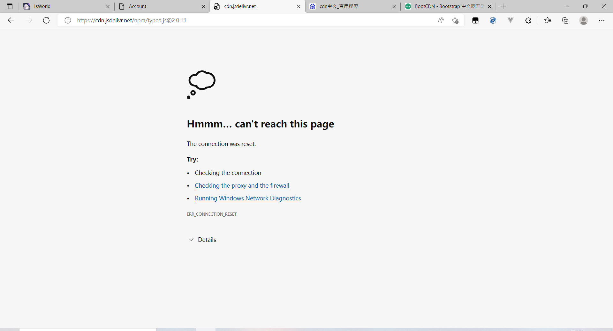
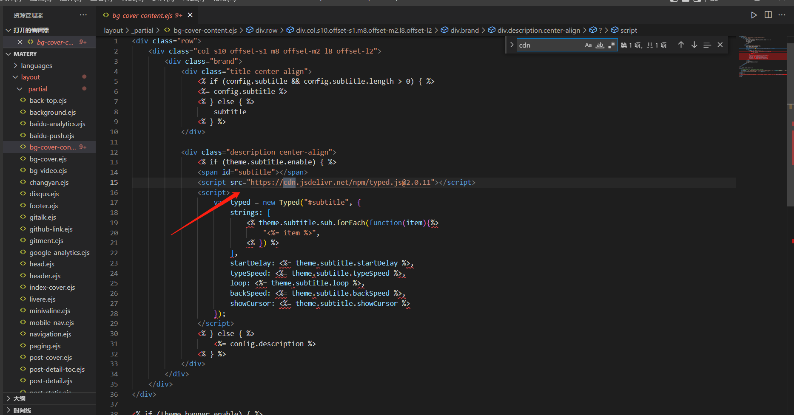
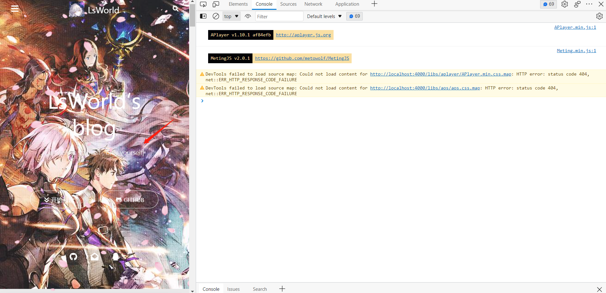

今天部署博客发现在本地运行的时候也会出现页面迟迟无法出现的问题，结果打开控制台面板一看发现`type.js`没有使用上。

查看源代码发现`https://cdn.jsdelivr.net/npm/typed.js@2.0.11`挂了，而matery主题默认使用`jsdelivr`来引入一些js代码。

现在在控制台中发现了错误，那解决办法就很简单了，在matery主题的源代码中将cdn换成国内加速就可以完美解决副标题不显示的问题了。

经过一路筛查后发现在主题文件的`\layout\_partial\bg-cover-content.ejs`中发现了代码。接下来把他替换成`https://cdn.bootcss.com/typed.js/2.0.5/typed.js`，就可以完美解决问题了

重新启动后发现报错没了，副标题也一如既往的显示了。

