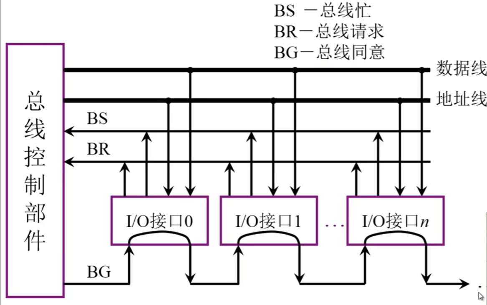
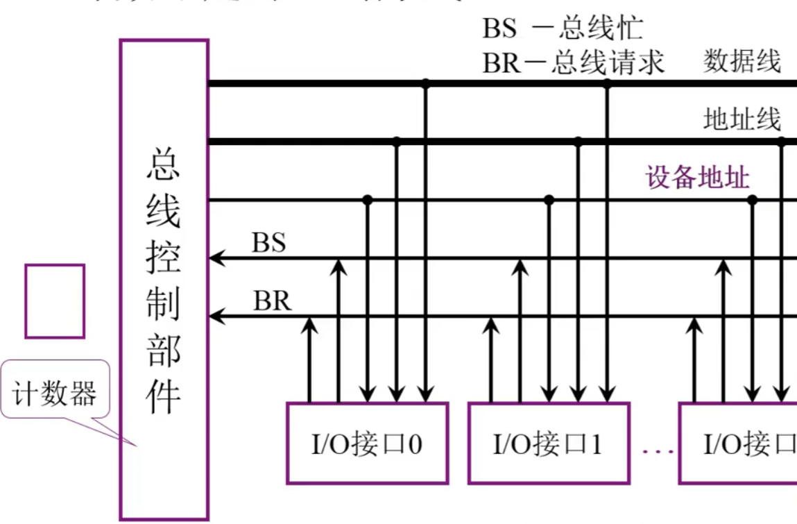
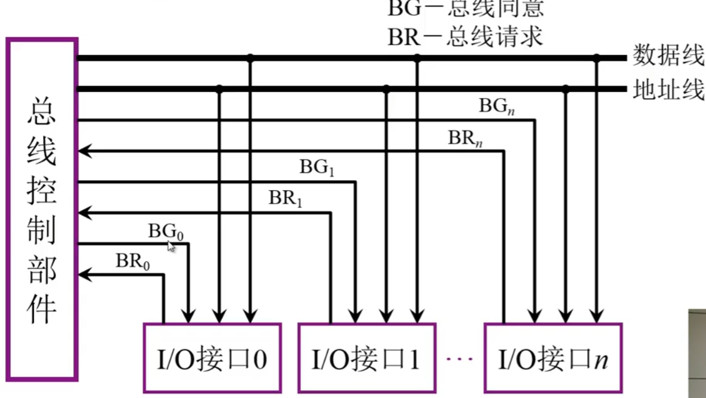

### 总线的基本概念

#### 一、为什么要用总线

分散连接存在的问题：

​	1.内部的连线复杂

​	2.新增IO设备困难

#### 二、什么是总线

​		总线是连接各个部件的信息传输线，是**各个部件共享的传输介质**

#### 三、总线上信息的传送

​	串行：所谓的串行就是将要传输的信息一位一位的放在总线上，接收方一位一位的进行接收，支持距离长

​	并行：需要多条数据线进行传输，数据能同步进行传输，如果传输距离长，线与线之间并行传输，传输信号可能会发生变形，接收方很难接收到正确信号

四、总线结构

​	1.单总线结构

​		所有数据在同一条总线上传输，会发生总线争用问题

​	2.面向CPU双总线结构

​		向CPU延生出两条总线，IO总线和M总线，M总线连接主存。

​		存在问题：一旦IO总线和M总线同时向CPU发送数据，CPU的计算任务还是会被打断。

​	3.以存储器为中心的双总线结构

​		从贮存延生两条总线，一条连接系统总线（包括IO设备接口和CPU），一条存储总线连接CPU。

------

### 3.2总线的分类

#### 	1.片内总线（芯片内部的总线）

#### 	2.系统总线（计算机各部件之间的信息）

##### 		1.数据总线

​			**双向**与机器字长、存储字长有关。通常情况下，总线宽度<=机器字长或存储字长

##### 		2.地址总线

​			**单向**与存储地址、IO地址有关

##### 		3.控制总线

​			**有出** **有入**：存储器读、存储器写，总线允许、中断确认（都是由CPU向外送）

#### 	3.通信总线

​		用于**计算机系统之间**或**计算机系统与其他系统**（如控制仪表、移动通信等）之间的通信

​		传输方式： 

​			串行通信总线 

​			并行通信总线

------

### 3.3总线特性及性能指标

#### 	总线特性

##### 		机械特性

​			尺寸、形状、管脚数以及排列顺序

##### 		电气特性

​			传输方向和有效的电平范围

##### 		功能特性

​			每根传输线的功能

##### 		时间特性

​			信号的时序关系

#### 	总线的性能指标

1. 总线宽度： 数据线的根数

2. 标准传输率：每秒传输的最大字节数（如MBps）  

3. 时钟同步/异步：同步还是不同步

4. 总线复用： 地址线与数据线复用（如8086）

5. 信号线数： 地址线、数据线和控制线的综合

6. 总线控制方式： 突发、自动、仲裁、逻辑、计数

7. 其他指标： 负载能力

   

------

### 3.4总线结构

#### 	单总线结构

​		将所有设备都连接在一条总线（系统总线）上

#### 	多总线结构

​	分为主存总线与IO总线，通过通道（具有特殊功能的处理器，由通道对IO统一管理）进行连接

##### 		主存总线

​		连接CPU和主存

##### 		IO总线

​		连接各种IO设备

#### 	三总线结构

##### 	结构一：

​	分为主存总线、IO总线、DMA总线（直接存储器访问）。

​	主存总线连接CPU与主存。

​	IO总线连接CPU与IO接口。

​	DMA总线连接主存与IO接口。

##### 	结构二：

​	分为局部总线、系统总线、扩展总线。

​	**局部总线**连接CPU和Cache与局部IO控制器。

​	**系统总线**连接主存与扩展总线接口。

​	**扩展总线**连接局域网、SCSI、扩展总线接口、Modem、串行接口

#### 	四总线结构

​	分为局部总线、系统总线、高速总线、扩展总线。

​	**局部总线**连接CPU和Cache/桥。

​	**系统总线**连接主存与Cache/桥。

​	**高速总线**连接SCSI、图形、多媒体、局域网、Cache/桥和扩展总线接口。

​	**扩展总线**连接FAX、扩展总线接口、Modem、串行接口。

#### 传统微型机总线结构

​	分为系统总线和IO总线

​	**系统总线**通过**33MHz的32位数据通路**连接CPU和主存控制器与存储器。

​	系统总线通过**标准总线控制器**与IO总线相连。

​	**IO总线**通过**8MHz的16位数据通路**连接SCSI II控制器、多媒体、高速局域网、高性能图形、Modem等。

#### VL-BUS局部总线结构

​	分为系统总线、VL-BUS总线、IO总线

​	**系统总线**连接CPU和主存控制器与存储器并延生一条线连接局部总线控制器和VL-BUS总线。

​	**VL-BUS总线（高速总线）**通过**33MHz的32位数据通路**连接标准总线控制器、SCSI II控制器、多媒体、高速局域网、高性能图形等。

​	**IO总线**通过**8MHz的16位数据通路**连接标准总线控制器、图文传真、Modem等

#### PCI总线结构

分为系统总线、PCI总线、IO总线

**系统总线**连接CPU、存储器和**PCI桥**

**PCI总线**通过**33MHz的32位数据通路**连接标准总线控制器、SCSI II控制器、多媒体、高速局域网、高性能图形等。

**IO总线**通过**8MHz的16位数据通路**连接标准总线控制器、图文传真、Modem等

#### 多层PCI总线结构

分为存储器总线与各种桥电路

------

### 3.5总线控制

如何完成通信过程，保证通信过程的准确性，这就是总线控制

#### 总线判优控制

##### 	基本概念

​		主设备（模块）：对总线由控制权

​		从设备（模块）：相应从主设备发来的总线命令**（有些设备既可以作为主设备也可以作为从设备）**

​		总线判优控制：

​			集中式（总线控制部件集中在一起）：

###### 				链式查询方式：

​			

​			数据线：用于信息交换过程数据的传输

​			地址线：主设备与从设备进行数据传输要通过地址总线

​			BR：所有线通过这条发送总线占用请求

​			BS：某个设备占用了总线通过这条线告诉其他部件总线忙

​			BG： 总线授权线

​			**注意：有一条总线出现故障，后面的电路均无法使用总线**

###### 		计时器定时查询方式：

​	

​			通过BR发送总线占用请求，总线控制部件收到请求后，通过**设备地址**向外传输响应。再通过计数器向IO接口进行查询是否提出了总线占用请求。最后通过BS进行应答。

​			这种方式优先级确定非常灵活。

###### 			独立请求方式：

​	

​	在总线控制部件中有排队器进行优先级控制

​		分布式：

​	

#### 总线通信控制

​	目的：解决通信双方协同配合问题

##### 	总线传输周期

​		申请分配阶段：主模块申请，总线仲裁决定

​		寻址阶段：主模块向从模块给出地址和命令

​		传数阶段：主模块和从模块交换数据

​		结束阶段：主模块撤销有关信息

##### 	总线通信的四种方式

​		同步通信：由统一时标控制数据传送

​		异步通信：采用应答方式，没有公告时钟标准

​		半同步通信：同步、异步结合

​			同步： 发送方用系统时钟前沿发信号

​						接收方用系统时钟后延判断、识别

​			异步：允许不同速度的模块和谐工作

​						增加一条“等待”响应信号

​		上述三种通信的共同点：

​		一个总线传输周期（以输入数据为例）

- ​	主模块发地址、命令   占用总线
- ​     从模块准备数据    不占用总线（此时总线空闲，对总线资源是一种浪费）
- ​     从模块向主模块发数据  占用总线

​		分离式通信：充分挖掘系统总线每个瞬间的最大效能

​			一个总线传输周期

​				子周期1    主模块申请占用总线，使用完后即放弃总线的使用权

​				子周期2     从模块申请占用总线，将各种信息送至总线上

​			分离式通信特点：

1. ​	各模块有权申请占用总线
2. 采用同步方式通信，不等对方回答
3. 各模块准备数据时，不占用总线
4. 总线被占用时，无空闲

**说明：以上图片与内容均在中国大学MOOC刘教授（刘宏伟）的网课下的总结与摘录**

